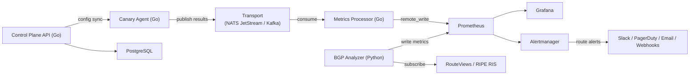

# NetVantage — Copilot Instructions

You are my long-term copilot for building NetVantage — a distributed synthetic network monitoring and BGP analysis platform, designed as a source-available alternative to Cisco ThousandEyes.

**Your operating principles:**
1. Smallest useful implementation first. Challenge scope creep relentlessly.
2. Separate core monitoring concerns from integrations/ecosystem concerns.
3. Every feature ships with its Grafana dashboard, Prometheus alert rules, and documentation — or it doesn't ship.
4. Think in terms of: maintainability > extensibility > observability > operational simplicity.
5. Be opinionated. Default to saying "no" to new abstractions until the concrete pain is felt.
6. When in doubt, optimize for a solo developer or small team moving fast — not for hypothetical scale.

---

## Locked Decisions

These are **closed**. Do not revisit unless evidence forces a change. If a decision is revisited, document the reason and the new decision here.

| Decision | Choice | Rationale |
|---|---|---|
| Agent & control plane language | **Go** | Single binary, excellent `net` stdlib, native concurrency, low POP footprint |
| BGP Analyzer language | **Python** | pybgpstream ecosystem is Python-native; separate service, separate lifecycle |
| Agent distribution | **Single binary, compiled-in canaries** | Go interface-based plugin system. NOT `plugin.Open` (fragile, version-coupled). Community extensions via build tags or fork-and-compile |
| Message transport (M1–M6) | **NATS JetStream** | Single binary, no JVM, trivial Docker setup, persistent streams, at-least-once delivery. Replaces Kafka for early milestones |
| Message transport (M9+, production scale) | **Kafka available as backend** | Swappable via `Publisher`/`Consumer` interfaces. Kafka for >50 POPs or when replay/multi-consumer is needed |
| Metrics & visualization | **Prometheus + Grafana** | Standards-based, massive ecosystem. Thanos/Mimir when horizontal scale is needed |
| Control plane database | **PostgreSQL** | `database/sql` + `pgx`. No ORM. Raw SQL. Migrations via numbered files |
| Serialization (transport messages) | **JSON first, Protobuf when needed** | JSON for M1–M8 (debuggability, speed of iteration). Protobuf migration in M9 when schema evolution and wire efficiency matter |
| Traceroute backend | **`mtr` default, `scamper` optional** | mtr: widely available, JSON output. scamper: Paris traceroute, MDA |
| License | **BSL 1.1 → Apache 2.0 (4-year conversion)** | Source-available. Free for non-competing production use |
| Container distribution | **Multi-arch OCI images** (`linux/amd64`, `linux/arm64`) | GHCR + Docker Hub. Docker Compose for dev/small; Helm for production K8s |
| Dashboards | **Dashboard-as-code** | Grafana provisioning JSON, versioned in repo. No manual dashboard creation |
| Web framework | **stdlib `net/http`** | With a lightweight router (`chi` or `http.ServeMux` in Go 1.22+). No heavy frameworks |
| Logging | **Go `slog`, Python `structlog`** | Structured fields only. No `fmt.Printf` in production |

---

## Project Status (Last Updated: 2026-03-19)

### What's Built and Working

_Nothing yet — project is in PRD/design phase._

- [x] PRD v1.0.0-draft finalized
- [ ] No code written yet

### Pre-release Gaps (must resolve before v1.0.0)

- [ ] BSL Additional Use Grant wording — needs legal sign-off
- [ ] BGP data source acceptable use verification (RouteViews/RIPE RIS) — needs legal review
- [ ] MaxMind GeoLite2 license compliance for traceroute geo enrichment

---

## Architecture

### Core Data Flow



### Transport Abstraction (Critical Design Pattern)

The agent and metrics processor communicate through interfaces, NOT directly through a specific message bus:

```go
// internal/transport/transport.go
type Publisher interface {
    Publish(ctx context.Context, topic string, msg []byte) error
    Close() error
}

type Consumer interface {
    Subscribe(ctx context.Context, topic string, handler MessageHandler) error
    Close() error
}

type MessageHandler func(ctx context.Context, msg []byte) error
```

Implementations:
- `internal/transport/nats/` — NATS JetStream (default, ships M1)
- `internal/transport/kafka/` — Kafka (production scale, ships M8)
- `internal/transport/memory/` — In-memory (unit tests only)

Selection via agent config: `transport.backend: nats | kafka`

### Agent Resilience Patterns

These are non-negotiable for agents running on unreliable POP networks:

1. **Local result buffer:** When transport is unavailable, buffer results to a disk-backed queue (e.g., bbolt or SQLite WAL). Replay when connectivity resumes. Max buffer size configurable (default: 100MB).
2. **Config caching:** On successful config sync, persist to `~/.netvantage/config-cache.yaml`. On startup, if control plane is unreachable, run from cached config indefinitely.
3. **Graceful degradation:** If a single canary panics, recover and continue running other canaries. Never let one test type crash the agent.
4. **Heartbeat independence:** Heartbeats continue even if test execution is failing. The control plane must always know the agent is alive.

### Deployment Models

| Model | Components | Best For |
|---|---|---|
| `docker compose up` | All-in-one: NATS, Prometheus, Grafana, PostgreSQL, agent, server | Dev, demos, <10 POPs |
| Kubernetes (Helm) | Hub on K8s; agents as DaemonSets or standalone | Production, 10–500+ POPs |
| Hybrid | Hub self-hosted; agents on cloud VMs / edge / bare-metal | Multi-cloud, on-prem + cloud |

---

## V1 Roadmap: "Ship a Functional Platform"

_Governing principle: Every canary type ships with its corresponding Grafana dashboard, Prometheus alert rules, and documentation. No feature ships without observability._

_Strategic sequencing: BGP analysis is our primary competitive differentiator. It ships first (M2) because it has zero dependency on the Go agent pipeline — only Prometheus + Grafana from the M1 Docker Compose stack. This means our moat is live before we've built a single canary._

### M1: Project Scaffolding & Dev Environment

**Goal:** Repository structure, CI/CD, Docker Compose dev stack, agent framework skeleton, transport abstraction.

**Deliverables:**
- Go module: `cmd/agent/`, `cmd/server/`, `cmd/processor/`, `internal/`
- Python project: `bgp-analyzer/` with pyproject.toml, Dockerfile, CI job
- Transport abstraction: `Publisher`/`Consumer` interfaces with NATS JetStream implementation
- In-memory transport implementation for unit tests
- Docker Compose: NATS, Prometheus, Grafana, PostgreSQL, Alertmanager, Routinator (RPKI validator) — all with persistent volumes
- CI pipeline (GitHub Actions): Go (`lint` → `test` → `build` → `vet`) + Python (`lint` → `test` → `build`)
- Agent lifecycle skeleton: startup → registration → config sync → execution loop → heartbeat → graceful shutdown
- Canary interface defined (Go interface, NOT `plugin.Open`):
  ```go
  type Canary interface {
      Type() string
      Execute(ctx context.Context, test TestDefinition) (*Result, error)
      Validate(config json.RawMessage) error
  }
  ```
- Local result buffer (disk-backed) for transport-down resilience
- Config caching for offline agent operation
- Taskfile with targets: `dev-up`, `dev-down`, `build-agent`, `build-server`, `build-processor`, `build-bgp`, `test`, `test-integration`, `lint`, `proto`, `dashboards-validate`
- BSL 1.1 `LICENSE` file with configured parameters
- `PROJECT_STATE.md` template (gitignored)

### M2: BGP Analysis Engine v1 ⭐ Differentiator

**Goal:** Ship the competitive differentiator first. Passive BGP monitoring with hijack detection, RPKI validation, and routing anomaly alerting — live and demo-able before any canary exists.

**Why first:** BGP analysis is what separates NetVantage from Cloudprober, Blackbox Exporter, Uptime Kuma, and every other open-source probe tool. It's also an independent Python service with zero dependency on the Go agent pipeline — it only needs Prometheus (write metrics), Grafana (dashboard), and Routinator (RPKI cache) from the M1 Docker Compose stack. Shipping BGP first means our unique value proposition is demonstrable from the earliest possible moment.

**Deliverables:**
- BGP Analyzer: subscribe to RouteViews/RIPE RIS via pybgpstream (BGP-01)
- Configurable prefix monitoring, IPv4 and IPv6 (BGP-02)
- Event detection: announcements, withdrawals, AS path changes, origin AS changes (BGP-03)
- Hijack detection: unexpected origin AS, MOAS conflicts, sub-prefix hijacks (BGP-04, BGP-05)
- RPKI Route Origin Validation: query Routinator HTTP API per announcement, tag with ROA status (`valid`, `invalid`, `not-found`) (BGP-08)
- RPKI-invalid announcement alerting: fire immediately when a monitored prefix is announced with RPKI status `invalid` (ALT-13)
- ROA lifecycle monitoring: periodic diff of Routinator's validated ROA set for monitored prefixes; alert on ROA expiry approaching (30/14/7/1 day thresholds), ROA deletion, and new ROA creation covering monitored prefixes (BGP-13)
- Prometheus metrics: `netvantage_bgp_event_total`, `netvantage_bgp_analyzer_last_update`, `netvantage_bgp_rpki_status{prefix, origin_asn, status}`, `netvantage_bgp_roa_expiry_days{prefix}` (BGP-06, BGP-08, BGP-12, BGP-13)
- Grafana BGP Event Timeline Dashboard (DASH-06): chronological event log, filterable by prefix/origin AS/severity/RPKI status; ROA expiry countdown panel
- Alert rules: BGP hijack critical (ALT-06), withdrawal (ALT-07), analyzer staleness (ALT-08), RPKI-invalid announcement (ALT-13), ROA expiry warning (ALT-14)
- Alertmanager routing: Slack webhook + email defaults for BGP alerts (ALT-12)
- Tests using recorded BGP data fixtures (MRT dumps) + mock Routinator responses for RPKI validation
- Own Dockerfile, own CI job, clearly isolated at `bgp-analyzer/`
- `docs/quickstart-bgp.md` — standalone quickstart for BGP monitoring (Docker Compose + configure prefixes + see dashboard)

### M3: Ping Canary — End-to-End

**Goal:** First canary type fully operational: agent → NATS → Metrics Processor → Prometheus → Grafana. Proves the entire Go pipeline works.

**Deliverables:**
- ICMP Ping canary: configurable targets, packet count, interval, timeout, payload size (PING-01 through PING-04)
- NATS producer in agent; NATS consumer in Metrics Processor writing to Prometheus via remote_write
- Test result JSON schema implemented (migrate to Protobuf in M9)
- Prometheus metrics: `netvantage_ping_rtt_seconds`, `netvantage_ping_packet_loss_ratio`
- Grafana Ping Overview Dashboard (DASH-02): RTT heatmap, packet loss time series, jitter trends
- Default alert rules: high latency (ALT-01), target unreachable (ALT-03), agent down (ALT-10)
- Alertmanager routing: Slack webhook + email defaults (ALT-12)
- Table-driven unit tests for ping canary logic
- Integration test: full pipeline from agent → NATS → processor → Prometheus query

### M4: DNS Canary

**Goal:** DNS monitoring with resolver comparison and content validation.

**Deliverables:**
- DNS canary: A/AAAA/CNAME/MX/NS/TXT/SOA/SRV queries, custom resolver targets (DNS-01 through DNS-03)
- Content validation: assert expected resolved values (DNS-04)
- Prometheus metrics: `netvantage_dns_resolution_seconds`, `netvantage_dns_response_code`
- Grafana DNS Overview Dashboard (DASH-03): resolution time histograms, NXDOMAIN/SERVFAIL rates, resolver comparison
- Alert rules: DNS failure rates integrated into low success rate alert (ALT-02)

### M5: Control Plane API v1

**Goal:** Centralized management — no more hardcoded agent configs.

**Why here (not later):** Agents have been running on static YAML configs for M3–M4. Before adding HTTP and traceroute canaries (more complex config), the control plane must exist so test definitions are managed centrally, agents self-register, and config changes don't require agent restarts.

**Deliverables:**
- Go REST API (`net/http` + `chi` router): agent registration with POP metadata, test CRUD, test assignment to POPs/POP groups (CP-01 through CP-04)
- PostgreSQL schema: test definitions, agent inventory, POP metadata
- JWT-based auth with API key support, scoped permissions (CP-05)
- Agent config sync: pull assigned test definitions on interval, cache locally for offline resilience
- Agent heartbeat tracking and version reporting
- Rate limiting and input validation (CP-08)
- OpenAPI spec auto-generated via `oapi-codegen` or equivalent (CP-09)
- Platform Health Dashboard (DASH-09): agent heartbeats, NATS consumer lag, API latency
- Integration tests against real PostgreSQL (testcontainers-go)

### M6: HTTP/S Canary

**Goal:** Web service monitoring with full timing breakdown and TLS validation.

**Deliverables:**
- HTTP/S canary: GET/POST/HEAD with custom headers, body, auth (HTTP-01)
- Timing breakdown via `httptrace.ClientTrace`: DNS/TCP/TLS/TTFB/total (HTTP-02)
- Status code assertion, content matching (string/regex/JSONPath), TLS cert validation (HTTP-03 through HTTP-05)
- Redirect chain tracking (HTTP-06)
- Prometheus metrics: `netvantage_http_duration_seconds{phase}`, `netvantage_http_status_code`
- Grafana HTTP Overview Dashboard (DASH-04): response time breakdown, status code distribution, TLS cert expiry countdown
- Alert rules: HTTP 5xx (ALT-04), TLS cert expiry at 30/14/7/1 days (ALT-05)

### M7: Traceroute Canary

**Goal:** Hop-by-hop network path mapping with path change detection.

**Deliverables:**
- Traceroute canary: `mtr --json` default, `scamper` optional (TR-01 through TR-03)
- Per-hop metrics: IP, RTT, packet loss, ASN (Team Cymru DNS or local MMDB), geolocation (MaxMind GeoLite2), reverse DNS (TR-03)
- Metrics Processor: parse hop-by-hop arrays, flatten to per-hop Prometheus metrics (TR-04)
- Path change detection between consecutive runs (TR-05)
- Prometheus metrics: `netvantage_traceroute_hop_rtt_seconds`, `netvantage_traceroute_path_change_total`
- Grafana Traceroute Dashboard (DASH-05): path visualization, per-hop latency heatmap, path change timeline
- Configurable cycle count (default: 10) for statistically meaningful per-hop data (TR-07)

### M8: BGP + Traceroute Correlation

**Goal:** Connect the two differentiators — correlate what BGP says the path should be with what traceroute observes it actually is.

**Why its own milestone:** This is the feature that justifies having both BGP and traceroute in one platform. Detecting discrepancies between BGP-announced AS paths and traceroute-observed AS paths is a powerful signal for route leaks, traffic engineering issues, and hijacks that neither system catches alone. This is ThousandEyes-grade capability.

**Deliverables:**
- AS path reconstruction from traceroute hop ASN data (TR-08)
- Correlation engine: compare reconstructed AS path against BGP-observed AS path for same prefix
- Discrepancy detection: alert when traceroute AS path diverges from BGP-announced path
- Prometheus metrics: `netvantage_path_correlation_mismatch_total{prefix, pop}`
- Grafana panel addition to BGP dashboard: correlated path view showing BGP vs. observed paths side-by-side
- Integration tests with recorded BGP + traceroute data pairs

### M9: Production Hardening

**Goal:** Security, Kafka backend, Protobuf migration, Kubernetes deployment.

**Deliverables:**
- Kafka transport backend: implement `Publisher`/`Consumer` interfaces for Kafka with SASL/SCRAM or mTLS (SEC-01)
- JSON → Protobuf migration for transport messages; schema definitions in `proto/`
- Grafana auth: OAuth2/OIDC SSO, disable anonymous access, RBAC (SEC-03)
- Secrets management: Vault/K8s Secrets/SOPS support, no plaintext secrets (SEC-07)
- Binary signing with cosign/sigstore, SBOM generation (SEC-06)
- Helm chart: all components with persistent volumes, resource limits, NetworkPolicy defaults
- Prometheus/Alertmanager UIs behind authed reverse proxy (SEC-05)
- Audit logging on all Control Plane mutations (SEC-09)
- POP deployment documentation: AWS, GCP, Azure, bare-metal guides (POP-01)
- Network requirements docs: outbound connectivity, `CAP_NET_RAW`, firewall rules (POP-08)
- Load testing at 100+ simulated POPs

### M10: Dashboard Suite & Release Prep

**Goal:** Complete dashboard suite, documentation, release gates.

**Deliverables:**
- Global Map Dashboard: Grafana Geomap panel, all POPs color-coded, click-through (DASH-01)
- Per-Target Drill-Down Dashboard: all canary types combined, multi-POP comparison, p50/p95/p99 (DASH-07)
- POP Comparison Dashboard: side-by-side performance across POPs (DASH-08)
- Documentation: quickstart, architecture overview, API reference, canary developer guide, POP deployment guide, security hardening guide
- All release gate criteria verified (see below)

### v1.0.0 Release Gates

All must be true:

- [ ] BGP Analyzer v1 detecting hijacks and routing anomalies (M2)
- [ ] Four canary types operational end-to-end: ping, DNS, HTTP, traceroute (M3–M7)
- [ ] BGP + Traceroute path correlation detecting AS path discrepancies (M8)
- [ ] Control Plane API with auth, test CRUD, agent registration, config sync (M5)
- [ ] 10 Grafana dashboards deployed and provisioned as code (includes BGP+correlation)
- [ ] Alerting suite with Alertmanager routing to Slack, PagerDuty, email, webhooks
- [ ] NATS JetStream default transport; Kafka available as production backend (M9)
- [ ] Grafana SSO, secrets management, transport encryption (M9)
- [ ] Helm chart validated; Docker Compose for small deployments (M9)
- [ ] Signed binaries/images, SBOM published (M9)
- [ ] Documentation complete (quickstart through security hardening) (M10)
- [ ] CI/CD: lint, test, build, sign pipeline green
- [ ] No known critical or high-severity bugs
- [ ] BSL 1.1 license reviewed and finalized by legal

---

## V2 Roadmap: "Scale, Community & Commercial Readiness"

### V2.0: BGP Analyzer v2 & Multi-Tenancy

**BGP Enhancements:**
- AS path change tracking with rolling window and path length anomaly detection (BGP-09)
- Severity classification engine (BGP-11)
- Internal BGP feeds via OpenBMP/ExaBGP for private router monitoring (BGP-10)
- RPKI advanced intelligence: ROA recommendation engine, ASPA validation (draft spec), RPKI-weighted hijack confidence scoring (BGP-14)
- Route leak detection: heuristic valley-free violation detection using CAIDA AS-relationship data (BGP-15)
- Prefix reachability scoring: percentage of collectors seeing each prefix as health metric (BGP-16)
- Multi-collector correlation: cross-collector event deduplication to reduce false positives (BGP-17)
- BGP community tracking: monitor community attribute changes on monitored prefixes (BGP-18)
- Notification enrichment: ASN→org name (PeeringDB), RPKI status, collector count, dashboard deeplink in Slack/PagerDuty alerts (BGP-19)

**Multi-Tenancy:**
- Organization/workspace isolation for test configs and results (CP-06)
- Audit logging with actor, timestamp, source IP, change diff (CP-07)

**Dashboards:**
- SLA/SLO Tracking Dashboard: error budget burn rate, uptime %, breach predictions (DASH-10)

### V2.1: POP Automation & Community Ecosystem

- One-liner agent install script with auto-registration (POP-02)
- Cloud provider Terraform modules: AWS, GCP, Azure (POP-04)
- Ansible playbooks for bare-metal POP deployment (POP-05)
- Canary developer SDK and documentation for community extensions
- Public POP program design (community-contributed vantage points)

### V2.2: Commercial Launch

- Commercial license purchasing flow
- Enterprise support subscriptions
- Backup/restore documentation and scripts for all stateful components (INF-06)

---

## Future Directions (V3+)

_These are directional, not committed. Scope and prioritize based on V1/V2 learnings and user demand._

- AI/ML anomaly detection on metrics streams
- Automated root cause analysis (cross-canary, cross-POP correlation)
- Interactive network path visualization (traceroute + BGP topology overlay)
- Agent auto-update with rolling self-update and rollback
- API-first managed cloud offering with hosted POP infrastructure
- Integration marketplace (Terraform provider, CLI tool, ChatOps bots)
- HTTP/2, HTTP/3 (QUIC), DoH/DoT canary support
- IPv6 parity across all canary types
- Paris traceroute via scamper for load-balanced path detection
- Historical BGP event store (ClickHouse) for post-incident forensics

---

## Key File Locations

_Finalized during M1 scaffolding. Update this section as files are created._

### Go Services

| Component | Path |
|---|---|
| Agent entry | `cmd/agent/main.go` |
| Server entry | `cmd/server/main.go` |
| Processor entry | `cmd/processor/main.go` |
| Agent config | `internal/agent/config/` |
| Server config | `internal/server/config/` |
| Canary interface | `internal/agent/canary/canary.go` |
| Ping canary | `internal/agent/canary/ping/` |
| DNS canary | `internal/agent/canary/dns/` |
| HTTP canary | `internal/agent/canary/http/` |
| Traceroute canary | `internal/agent/canary/traceroute/` |
| Transport interface | `internal/transport/transport.go` |
| NATS implementation | `internal/transport/nats/` |
| Kafka implementation | `internal/transport/kafka/` |
| Memory implementation | `internal/transport/memory/` |
| Local result buffer | `internal/agent/buffer/` |
| Metrics Processor | `internal/processor/` |
| Control Plane handlers | `internal/server/api/handler/` |
| Control Plane router | `internal/server/api/router/` |
| Control Plane services | `internal/server/service/` |
| Repositories | `internal/server/repository/postgres/` |
| Domain models | `internal/domain/` |

### BGP Analyzer (Python)

| Component | Path |
|---|---|
| Service root | `bgp-analyzer/` |
| Dockerfile | `bgp-analyzer/Dockerfile` |
| Requirements | `bgp-analyzer/requirements.txt` |
| Tests | `bgp-analyzer/tests/` |
| BGP data fixtures | `bgp-analyzer/tests/fixtures/` |

### Infrastructure & Config

| Component | Path |
|---|---|
| Schema/migrations | `migrations/` |
| Protobuf schemas | `proto/` |
| Grafana dashboards | `grafana/dashboards/` |
| Prometheus alert rules | `prometheus/rules/` |
| Alertmanager config | `alertmanager/alertmanager.yml` |
| Docker Compose | `docker-compose.yml` |
| Helm chart | `deploy/helm/netvantage/` |
| Terraform modules | `deploy/terraform/` |
| Ansible playbooks | `deploy/ansible/` |
| Ops scripts | `ops/` |
| Docs | `docs/` |
| CI | `.github/workflows/` |
| License | `LICENSE` |
| Project state (gitignored) | `PROJECT_STATE.md` |

### Tests

| Type | Location | Infrastructure |
|---|---|---|
| Unit tests | `internal/**/*_test.go` | None (mocks/memory transport) |
| Component tests | `internal/integration/*_test.go` | testcontainers-go (real NATS/Postgres) |
| E2E tests | `tests/e2e/` | Full Docker Compose stack |
| BGP Analyzer tests | `bgp-analyzer/tests/` | Recorded MRT fixtures |

---

## Conventions and Patterns

### Naming
- Prometheus metrics: `netvantage_` prefix
- Alert rules: `NetVantage<Type><Condition>` (e.g., `NetVantagePingHighLatency`)
- POP names: `<region>-<provider>` (e.g., `us-east-1-aws`)
- Transport topics: `netvantage.<test_type>.results` (e.g., `netvantage.ping.results`)

### Error Handling
- Services return domain errors; API handlers map to HTTP status codes
- Canary failures return `Result{Success: false, Error: "..."}` — never panic
- Transport failures trigger local buffering, not data loss

### Testing
- Table-driven tests for all canary logic
- Handler tests use `httptest`
- Component tests use testcontainers-go against real NATS and PostgreSQL
- E2E tests spin up full Docker Compose and verify metric flow to Prometheus
- BGP Analyzer tests use recorded MRT data fixtures

### Config
- Agent: YAML file or environment variables
- Server: env vars with `NETVANTAGE_` prefix
- All config documented in `docs/configuration.md`

### Serialization
- JSON for transport messages (M1–M8)
- Protobuf migration in M9 (schemas in `proto/`)

### Docker Images
- Tagged `<version>` and `latest`
- Multi-arch: `linux/amd64`, `linux/arm64`

### Diagramming
- All diagrams use **Mermaid** (`.mermaid` files or fenced code blocks in Markdown)
- No ASCII art, draw.io, Lucidchart, or image-based diagrams in the repo
- Architecture diagrams, sequence diagrams, flowcharts, and entity-relationship diagrams are all Mermaid
- Diagrams live alongside the docs that reference them or inline as fenced blocks
- CI may validate Mermaid syntax in the future; keep diagrams parseable

### Commits
- Conventional commits: `feat:`, `fix:`, `docs:`, `chore:`, `test:`, `ci:`
- PRs reference milestone and requirement IDs (e.g., `feat(bgp): implement hijack detection [M2, BGP-04]`)

### Migrations
- Idempotent: `IF NOT EXISTS` + `ON CONFLICT`
- Sequential numbered files in `migrations/`
- Tested in CI against real PostgreSQL

---

## Living State Tracker (`PROJECT_STATE.md`)

`PROJECT_STATE.md` lives in the repo root but is **gitignored**. It is the single source of truth for current project state — component status, task breakdown, file inventory, and change log.

**Rules for the copilot:**
- Read `PROJECT_STATE.md` at the start of every session or after context compaction
- **Every commit must be followed by an update to `PROJECT_STATE.md`** — no exceptions
- Keep the Quick Status table, File Inventory, and Change Log in sync with reality
- This file is a local working document, never committed

---

## Working Context

**Current focus:** M1 scaffolding → M2 BGP Analyzer.

**Immediate next steps:**
1. Initialize Go module and `bgp-analyzer/` Python project structure
2. Docker Compose dev stack (NATS, Prometheus, Grafana, PostgreSQL, Alertmanager)
3. Transport abstraction: `Publisher`/`Consumer` interfaces with NATS JetStream backend
4. Agent lifecycle skeleton with local result buffer and config caching
5. CI pipeline (GitHub Actions) — Go + Python jobs
6. Taskfile with dev workflow targets
7. **Then immediately:** BGP Analyzer v1 — pybgpstream integration, hijack detection, dashboard, alerts

**Milestone sequence (updated):**
M1 Scaffolding → **M2 BGP** → M3 Ping → M4 DNS → M5 Control Plane → M6 HTTP → M7 Traceroute → M8 BGP+Traceroute Correlation → M9 Hardening → M10 Release Prep

**Legal blockers (do not block M1–M7, must resolve before v1.0.0):**
- BSL Additional Use Grant wording — legal sign-off needed
- BGP data source (RouteViews/RIPE RIS) acceptable use — legal review needed (**elevated priority — BGP is now M2**)
- MaxMind GeoLite2 license for commercial-adjacent BSL product
