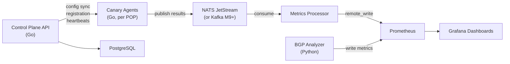

# NetVantage

**Distributed synthetic network monitoring and BGP analysis platform.**

A source-available alternative to Cisco ThousandEyes — combining distributed probe agents, passive BGP monitoring with RPKI validation, and traceroute-to-BGP path correlation in a single platform.

## Why NetVantage?

Existing open-source monitoring tools (Blackbox Exporter, Cloudprober, Uptime Kuma) handle synthetic probes well but stop there. None of them touch BGP routing analysis. Commercial platforms like ThousandEyes bundle both but cost $10k+/year.

NetVantage bridges that gap: deploy lightweight agents across your infrastructure, monitor reachability and performance from every vantage point, and correlate what you observe with what BGP says should be happening — all with dashboards, alerts, and RPKI validation out of the box.

### Key Capabilities

**Synthetic Monitoring** — ICMP ping, DNS resolution, HTTP/S with full timing breakdown, and traceroute with per-hop ASN/geo enrichment. Agents run as single Go binaries with sub-10MB footprint.

**BGP Analysis** — Passive monitoring of RouteViews and RIPE RIS collectors via pybgpstream. Detects prefix hijacks, MOAS conflicts, sub-prefix hijacks, unexpected withdrawals, and AS path changes for your monitored prefixes.

**RPKI Route Origin Validation** — Every BGP announcement is validated against RPKI ROAs via Routinator. Alerts fire immediately on RPKI-invalid announcements. ROA lifecycle monitoring warns you before ROAs expire.

**BGP + Traceroute Correlation** — Compares the AS path BGP announces with the AS path traceroute actually observes. Detects route leaks, traffic engineering issues, and hijacks that neither system catches alone.

**Dashboard-as-Code** — Every feature ships with its Grafana dashboard and Prometheus alert rules, provisioned as code and versioned in this repo.

## Architecture



Agents communicate through a transport abstraction layer (`Publisher`/`Consumer` interfaces), defaulting to NATS JetStream for development and small deployments. Kafka is available as a production backend for 50+ POP deployments. The swap requires a single config change — no code changes.

See [docs/ARCHITECTURE.md](docs/ARCHITECTURE.md) for the full design.

## Quick Start

### Prerequisites

- Docker and Docker Compose
- Go 1.22+ (for building agents)
- [Task](https://taskfile.dev) (task runner, replaces Make)

### Start the Dev Stack

```bash
# Clone the repo
git clone https://github.com/<your-username>/netvantage.git
cd netvantage

# Start all infrastructure (NATS, Prometheus, Grafana, PostgreSQL, Alertmanager, Routinator)
task dev-up

# Verify services are running
task dev-logs
```

### Access Services

| Service | URL | Credentials |
|---|---|---|
| Grafana | http://localhost:3000 | admin / admin |
| Prometheus | http://localhost:9090 | — |
| NATS Monitoring | http://localhost:8222 | — |
| Alertmanager | http://localhost:9093 | — |

### Build and Run

```bash
# Build all Go binaries
task build-agent
task build-server
task build-processor

# Build BGP Analyzer container
task build-bgp

# Run tests
task test          # Go unit tests
task test-bgp      # Python BGP tests
task lint-go       # Go linting
task lint-python   # Python linting
```

See [docs/quickstart.md](docs/quickstart.md) for a detailed walkthrough.

## Project Status

NetVantage is in active early development. See the [Roadmap](docs/ROADMAP.md) for the full milestone plan.

| Milestone | Status | Description |
|---|---|---|
| M1: Scaffolding | ✅ Complete | Project structure, transport abstraction, dev stack |
| M2: BGP Analysis | 🔜 Next | Hijack detection, RPKI validation, BGP dashboards |
| M3: Ping Canary | Planned | First canary type, end-to-end pipeline proof |
| M4: DNS Canary | Planned | DNS monitoring with resolver comparison |
| M5: Control Plane | Planned | Centralized agent management API |
| M6: HTTP/S Canary | Planned | Web monitoring with TLS validation |
| M7: Traceroute | Planned | Hop-by-hop path mapping |
| M8: BGP+Traceroute | Planned | AS path correlation engine |
| M9: Hardening | Planned | Kafka backend, Protobuf, Helm, security |
| M10: Release Prep | Planned | Dashboard suite, docs, release gates |

## Tech Stack

| Component | Technology |
|---|---|
| Agent & Control Plane | Go 1.22+ |
| BGP Analyzer | Python 3.12 (pybgpstream) |
| Message Transport | NATS JetStream (default), Kafka (production) |
| Metrics & Visualization | Prometheus + Grafana |
| RPKI Validation | Routinator |
| Database | PostgreSQL |
| CI/CD | GitHub Actions |
| Task Runner | [Taskfile](https://taskfile.dev) |

## Documentation

- [Architecture](docs/ARCHITECTURE.md) — system design, data flow, transport abstraction, resilience patterns
- [Roadmap](docs/ROADMAP.md) — milestone plan with deliverables and requirement IDs
- [Quick Start](docs/quickstart.md) — get running in 5 minutes
- [Contributing](docs/CONTRIBUTING.md) — development workflow, conventions, how to add canary types

## License

NetVantage is source-available under the [Business Source License 1.1](LICENSE). Free for non-competing production use. Converts to Apache 2.0 four years after each release.

**TL;DR:** Use it for monitoring your own infrastructure, contribute to it, build internal tools with it — all fine. Don't resell it as a competing managed monitoring service.
