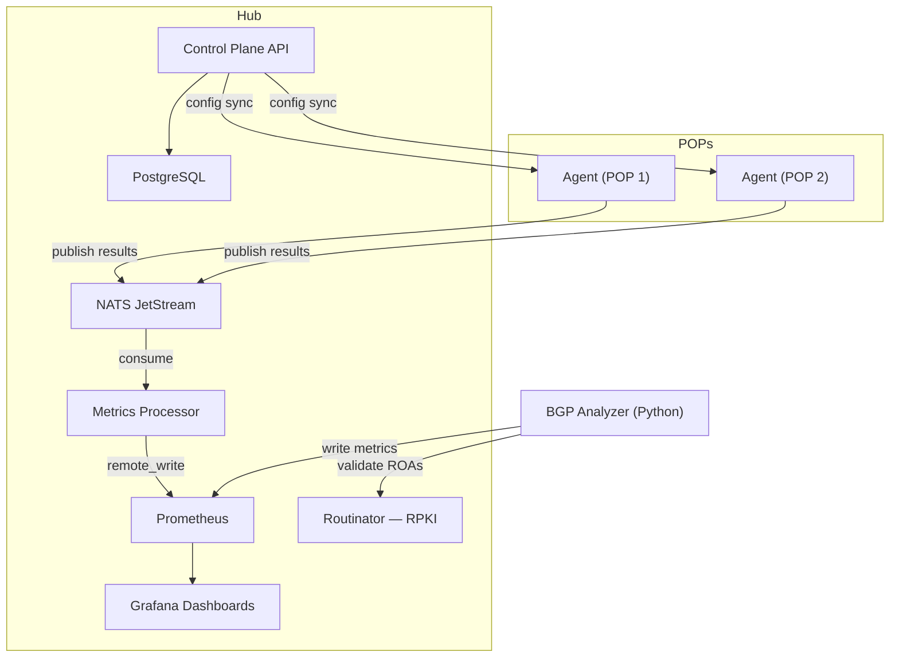

# NetVantage — Distributed Network Monitoring & BGP Analysis

A source-available alternative to Cisco ThousandEyes. Deploy lightweight agents across your infrastructure, monitor reachability and performance from every vantage point, and correlate what you observe with what BGP says should be happening — with dashboards, alerts, and RPKI validation out of the box.

[](LICENSE)
[](https://go.dev)
[](https://python.org)
[](docs/ROADMAP.md)

## What It Does

NetVantage gives you a single platform for synthetic monitoring *and* BGP routing analysis. The **canary agents** are single Go binaries (sub-10MB) that run at your Points of Presence and execute synthetic tests — ICMP ping, DNS resolution, HTTP/S with full timing breakdown, traceroute with per-hop ASN and geolocation enrichment. Results flow through NATS JetStream into Prometheus and Grafana dashboards that are provisioned as code and versioned in this repo.

The **BGP analyzer** is an independent Python service that monitors the global routing table via RouteViews and RIPE RIS. It detects prefix hijacks, MOAS conflicts, sub-prefix hijacks, unexpected withdrawals, and AS path anomalies for your IP space. Every announcement is validated against RPKI ROAs through Routinator, with immediate alerts on invalid origins and countdown warnings before your ROAs expire.

The **correlation engine** (M8) is what ties both systems together: it compares the AS path BGP announces against the AS path traceroute actually observes. Discrepancies reveal route leaks, traffic engineering problems, and hijacks that neither system catches alone. This is ThousandEyes-grade capability in a source-available package.



Agents communicate through a transport abstraction layer (`Publisher`/`Consumer` interfaces), defaulting to NATS JetStream for development and small deployments. Kafka is available as a production backend for 50+ POP deployments — the swap requires a single config change, no code changes.

## Quick Start

```bash
git clone https://github.com/shankar0123/netvantage.git
cd netvantage

# Start all infrastructure
task dev-up

# Build Go services (go mod tidy on first clone)
go mod tidy
task build-agent && task build-server && task build-processor
```

| Service | URL | Credentials |
|---|---|---|
| Grafana | http://localhost:3000 | admin / netvantage |
| Prometheus | http://localhost:9090 | — |
| NATS Monitoring | http://localhost:8222 | — |
| Alertmanager | http://localhost:9093 | — |

See the [Guided Demo](docs/quickstart.md) for a full walkthrough with explanations at every step.

## Project Status

NetVantage is in active early development. The BGP analyzer — our primary competitive differentiator — ships first because it has zero dependency on the Go agent pipeline.

| Milestone | Status | Description |
|---|---|---|
| M1: Scaffolding | ✅ Complete | Project structure, transport abstraction, dev stack |
| M2: BGP Analysis | ✅ Complete | Hijack detection, RPKI validation, BGP dashboards |
| M3: Ping Canary | ✅ Complete | First canary type, end-to-end pipeline proof |
| M4: DNS Canary | ✅ Complete | DNS monitoring with resolver comparison |
| M5: Control Plane | 🔜 Next | Centralized agent management API |
| M6: HTTP/S Canary | Planned | Web monitoring with TLS validation |
| M7: Traceroute | Planned | Hop-by-hop path mapping |
| M8: BGP+Traceroute | Planned | AS path correlation engine |
| M9: Hardening | Planned | Kafka backend, Protobuf, Helm, security |
| M10: Release Prep | Planned | Dashboard suite, docs, release gates |

## Documentation

| Doc | What You'll Learn |
|---|---|
| **[Understanding NetVantage](docs/concepts.md)** | Start here. The problem space, BGP, RPKI, and how everything fits together — no networking background required. |
| **[Guided Demo](docs/quickstart.md)** | Get the full stack running locally with explanations at every step. |
| **[BGP Monitoring Demo](docs/quickstart-bgp.md)** | Set up hijack detection, RPKI validation, and explore the BGP dashboard. |
| **[Architecture](docs/ARCHITECTURE.md)** | Technical deep dive with design rationale for every decision. |
| **[Contributing](docs/CONTRIBUTING.md)** | Development workflow, conventions, and how to add canary types. |

## Tech Stack

| Component | Technology |
|---|---|
| Agent & Control Plane | Go 1.22+ |
| BGP Analyzer | Python 3.12 (pybgpstream) |
| Message Transport | NATS JetStream (default) · Kafka (production) |
| Metrics & Visualization | Prometheus + Grafana |
| RPKI Validation | Routinator |
| Database | PostgreSQL |
| CI/CD | GitHub Actions |

## License

NetVantage is source-available under the [Business Source License 1.1](LICENSE). Free for non-competing production use. Converts to Apache 2.0 four years after each release.

Use it for monitoring your own infrastructure, contribute to it, build internal tools with it — all fine. Don't resell it as a competing managed monitoring service.
