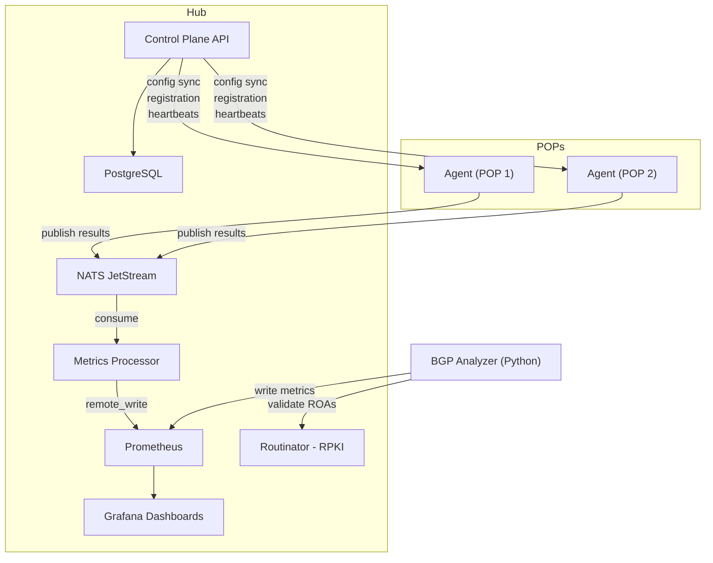

# NetVantage — Architecture

## Overview

NetVantage is a hub-and-spoke distributed monitoring platform. Lightweight agents deployed at network points of presence (POPs) execute synthetic tests and publish results through a message transport layer. A centralized hub processes results into Prometheus metrics, manages agent configuration, and serves Grafana dashboards.

A separate Python-based BGP analyzer monitors global routing tables independently, detecting hijacks and validating RPKI status. The two systems converge when traceroute-observed AS paths are correlated against BGP-announced AS paths.

## Core Data Flow



## Component Details

### Canary Agent (Go)

The agent is a single statically-compiled Go binary designed to run on minimal infrastructure — cloud VMs, edge nodes, bare-metal servers, or containers. It executes synthetic tests (canaries) on a configurable schedule and publishes results to the message transport.

**Canary types** (each implements the `Canary` interface):

| Type | Milestone | What It Measures |
|---|---|---|
| ICMP Ping | M3 | RTT, jitter, packet loss |
| DNS | M4 | Resolution time, response codes, content validation |
| HTTP/S | M6 | Full timing breakdown (DNS/TCP/TLS/TTFB), status codes, TLS cert |
| Traceroute | M7 | Per-hop RTT, packet loss, ASN, geolocation, path changes |

**Canary interface:**

```go
type Canary interface {
    Type() string
    Execute(ctx context.Context, test TestDefinition) (*Result, error)
    Validate(config json.RawMessage) error
}
```

New canary types are added by implementing this interface and registering with the agent at startup. This uses Go's standard interface mechanism — not `plugin.Open`, which is fragile and version-coupled.

**Lifecycle:** startup → registration with control plane → config sync → test execution loop → heartbeat loop → graceful shutdown.

### Transport Abstraction

The agent and metrics processor communicate through interfaces, not directly through a specific message bus:

```go
type Publisher interface {
    Publish(ctx context.Context, topic string, msg []byte) error
    Close() error
}

type Consumer interface {
    Subscribe(ctx context.Context, topic string, handler MessageHandler) error
    Close() error
}
```

**Implementations:**

| Backend | Path | Use Case |
|---|---|---|
| NATS JetStream | `internal/transport/nats/` | Default for dev and deployments up to ~50 POPs |
| Kafka | `internal/transport/kafka/` | Production scale, multi-consumer replay (M9+) |
| In-memory | `internal/transport/memory/` | Unit tests only |

Selection is via agent config (`transport.backend: nats | kafka`). Swapping backends requires zero code changes.

**Topic convention:** `netvantage.<test_type>.results` (e.g., `netvantage.ping.results`).

### Metrics Processor (Go)

Consumes test results from the transport layer, computes derived metrics (e.g., jitter from consecutive ping RTTs), and writes to Prometheus via `remote_write`. Each canary type has a dedicated handler that understands the result schema and maps it to the appropriate Prometheus metric names.

### BGP Analyzer (Python)

An independent service that subscribes to public BGP data streams (RouteViews and RIPE RIS) via pybgpstream. It monitors a configurable set of prefixes and detects routing anomalies.

**Detection capabilities:**

- Prefix hijacks (unexpected origin AS)
- MOAS (Multiple Origin AS) conflicts
- Sub-prefix hijacks
- Unexpected withdrawals
- AS path changes

**RPKI validation:** Every BGP announcement for a monitored prefix is validated against RPKI ROAs by querying the Routinator HTTP API. Announcements are tagged as `valid`, `invalid`, or `not-found`. RPKI-invalid announcements trigger immediate alerts.

**ROA lifecycle monitoring:** Periodic diffing of Routinator's validated ROA set detects ROA expiry (alerts at 30/14/7/1 day thresholds), ROA deletion, and new ROA creation for monitored prefixes.

The BGP analyzer writes metrics directly to Prometheus — it does not use the NATS transport layer. This keeps it fully independent of the Go agent pipeline.

### Control Plane API (Go)

REST API for centralized management (ships in M5):

- Agent registration with POP metadata
- Test definition CRUD
- Test assignment to POPs or POP groups
- Agent config sync (agents pull their assigned tests on interval)
- Heartbeat tracking and version reporting
- JWT + API key authentication

Backed by PostgreSQL with raw SQL (no ORM). Migrations are idempotent numbered files.

### Observability Stack

**Prometheus** — Central metrics store. Scrapes NATS and BGP analyzer directly. Receives agent metrics via `remote_write` through the metrics processor.

**Grafana** — All dashboards are provisioned as code (JSON files in `grafana/dashboards/`). No manual dashboard creation.

**Alertmanager** — Evaluates Prometheus alert rules and routes to Slack, PagerDuty, email, or webhooks. Alert rules live in `prometheus/rules/` and are versioned with the repo.

## Agent Resilience Patterns

These are non-negotiable for agents running on unreliable POP networks.

**Local result buffer.** When the transport layer is unavailable, results are buffered to a local queue. When connectivity resumes, buffered results are replayed. This ensures zero data loss during transport outages.

**Config caching.** On successful config sync, the agent persists its configuration locally. If the control plane is unreachable at startup, the agent runs from cached config indefinitely.

**Per-canary isolation.** If a single canary panics, the agent recovers and continues running all other canaries. One failing test type never crashes the agent.

**Heartbeat independence.** Heartbeats to the control plane continue even if test execution is failing. The control plane always knows the agent is alive, regardless of test health.

## Deployment Models

| Model | Components | Best For |
|---|---|---|
| Docker Compose | All-in-one stack | Dev, demos, <10 POPs |
| Kubernetes (Helm) | Hub on K8s, agents as DaemonSets | Production, 10–500+ POPs |
| Hybrid | Hub self-hosted, agents on diverse infra | Multi-cloud, on-prem + cloud |

## BGP + Traceroute Correlation (M8)

The platform's unique capability: comparing what BGP says the AS path should be with what traceroute observes it actually is.

The correlation engine reconstructs an AS path from traceroute hop ASN data and compares it against the BGP-observed AS path for the same prefix. Discrepancies indicate route leaks, traffic engineering issues, or hijacks that neither BGP monitoring nor traceroute alone would catch.

## Security Model (M9)

- Transport encryption: NATS TLS, Kafka SASL/SCRAM or mTLS
- Grafana: OAuth2/OIDC SSO, RBAC, no anonymous access
- Prometheus/Alertmanager UIs behind authenticated reverse proxy
- Secrets management via Vault, K8s Secrets, or SOPS
- Binary signing with cosign/sigstore, SBOM generation
- Audit logging on all control plane mutations
