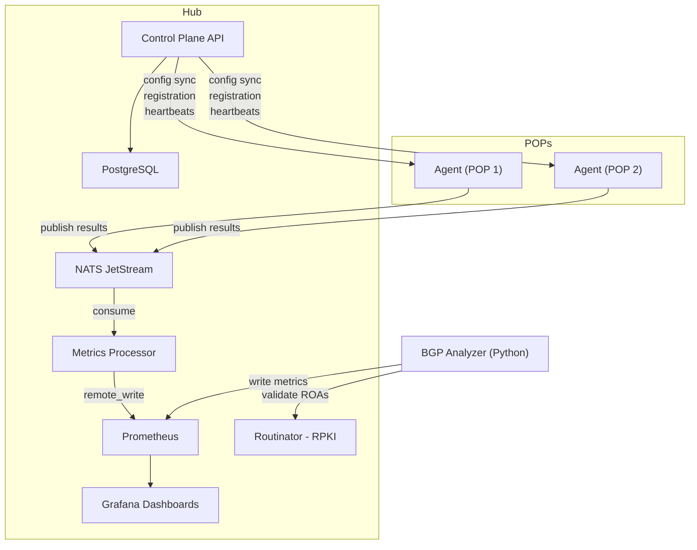

# NetVantage — Architecture

This document describes the technical design of NetVantage: what each component does, why it's built that way, and how the pieces connect. It's written for developers and operators who want to understand the system deeply enough to contribute, debug, or extend it.

**New to NetVantage?** Start with [Understanding NetVantage](concepts.md) for a beginner-friendly introduction before diving into architecture.

## Overview

NetVantage is a hub-and-spoke distributed monitoring platform. Lightweight agents deployed at network points of presence (POPs) execute synthetic tests and publish results through a message transport layer. A centralized hub processes results into Prometheus metrics, manages agent configuration, and serves Grafana dashboards.

A separate Python-based BGP analyzer monitors global routing tables independently, detecting hijacks and validating RPKI status. The two systems converge in M8 when traceroute-observed AS paths are correlated against BGP-announced AS paths.

**Why hub-and-spoke?** Agents run on potentially unreliable remote networks — cloud VMs in different regions, edge servers, bare-metal boxes. They need to be simple, resilient, and self-sufficient. A centralized hub handles the complex processing, storage, and visualization that doesn't need to run at the edge. The message bus between them (NATS JetStream) provides the durability and decoupling that makes this work over unreliable links.

## Core Data Flow



## Component Details

### Canary Agent (Go)

The agent is a single statically-compiled Go binary designed to run on minimal infrastructure — cloud VMs, edge nodes, bare-metal servers, or containers. It executes synthetic tests (canaries) on a configurable schedule and publishes results to the message transport.

**Why Go?** Agents need to be tiny (single binary, no runtime dependencies), fast-starting, and excellent at concurrent I/O. Go's `net` standard library is battle-tested for network operations, and static compilation means zero deployment friction. We considered Rust (lower memory, stronger safety guarantees) but Go's faster iteration speed and simpler concurrency model won for a small team moving fast.

**Why "canary"?** Like a canary in a coal mine — these tests are the early warning system. If a ping canary starts showing 50% packet loss from Singapore, you know something is wrong before your users complain.

**Canary types** (each implements the `Canary` interface):

| Type | Milestone | What It Measures | Why It Matters |
|---|---|---|---|
| ICMP Ping | M3 | RTT, jitter, packet loss | The most fundamental reachability check. If ping fails, nothing else works. |
| DNS | M4 | Resolution time, response codes, content validation | DNS failure is the #1 cause of "site down" that isn't actually a server issue. |
| HTTP/S | M6 | Full timing breakdown (DNS/TCP/TLS/TTFB), status codes, TLS cert | The user-facing check. Catches slow backends, TLS misconfigs, CDN issues. |
| Traceroute | M7 | Per-hop RTT, packet loss, ASN, geolocation, path changes | Reveals the network path. Detects rerouting, congestion points, path instability. |

**Canary interface:**

```go
type Canary interface {
    Type() string
    Execute(ctx context.Context, test TestDefinition) (*Result, error)
    Validate(config json.RawMessage) error
}
```

New canary types are added by implementing this interface and registering with the agent at startup. This uses Go's standard interface mechanism — not `plugin.Open`, which is fragile and version-coupled.

**Why not `plugin.Open`?** Go's plugin system requires plugins to be compiled with the exact same Go version, dependency versions, and build flags as the host binary. In practice, this means you can't distribute plugins independently — they're effectively tied to a specific build of the agent. Interface-based extensibility is simpler and more reliable: implement the interface, compile it in, done.

**Agent lifecycle:** startup → registration with control plane → config sync → test execution loop → heartbeat loop → graceful shutdown.

### Transport Abstraction

This is one of the most important design patterns in the codebase. The agent and metrics processor communicate through interfaces, not directly through a specific message bus:

```go
type Publisher interface {
    Publish(ctx context.Context, topic string, msg []byte) error
    Close() error
}

type Consumer interface {
    Subscribe(ctx context.Context, topic string, handler MessageHandler) error
    Close() error
}
```

**Why an abstraction layer?** We use NATS JetStream for development and small deployments because it's a single binary with zero operational overhead. But some production environments need Kafka (replay, multi-consumer groups, integration with existing data pipelines). The abstraction means switching backends requires a single config change — `transport.backend: kafka` — with zero code changes. Business logic never imports `nats` or `kafka` directly.

**Implementations:**

| Backend | Path | Use Case | Why This Backend |
|---|---|---|---|
| NATS JetStream | `internal/transport/nats/` | Default, deployments up to ~50 POPs | Single binary, no JVM, trivial Docker setup, persistent streams |
| Kafka | `internal/transport/kafka/` | Production scale, M9+ | Ecosystem integration, multi-consumer replay, battle-tested at massive scale |
| In-memory | `internal/transport/memory/` | Unit tests only | Synchronous, deterministic, no external dependencies |

**Topic convention:** `netvantage.<test_type>.results` (e.g., `netvantage.ping.results`). Each canary type publishes to its own topic, so the metrics processor can subscribe selectively.

### Metrics Processor (Go)

Consumes test results from the transport layer, computes derived metrics (e.g., jitter from consecutive ping RTTs), and writes to Prometheus via `remote_write`.

**Why a separate processor instead of having agents write directly to Prometheus?** Two reasons. First, agents may be behind firewalls or NAT — they can push to NATS but Prometheus can't scrape them. Second, the processor handles metric computation that spans multiple results (jitter requires comparing consecutive pings, path change detection requires comparing consecutive traceroutes). Moving this logic to the hub keeps agents simple.

Each canary type has a dedicated handler that understands the result schema and maps it to the appropriate Prometheus metric names. This is where raw test results become structured time-series data.

### BGP Analyzer (Python)

An independent service that subscribes to public BGP data streams (RouteViews and RIPE RIS) via pybgpstream. It monitors a configurable set of prefixes and detects routing anomalies.

**Why Python?** The pybgpstream library — the standard tool for consuming BGP data — is Python-native with C extensions. There's no equivalent in Go. Rather than build a less capable Go implementation, we use the best tool for the job and keep it as a separate service.

**Why a separate service?** The BGP analyzer has completely different operational characteristics from the Go pipeline. Different language, different dependencies (C libraries), different lifecycle, different failure modes. It also has zero dependency on agents or NATS — it subscribes to public data streams and writes metrics straight to Prometheus. Coupling it to the Go services would create unnecessary fragility.

**Detection capabilities:**

- **Prefix hijacks** — Unexpected origin AS announcing your prefix. Detected by comparing against configured `expected_origins`.
- **MOAS conflicts** — Multiple Origin AS: two or more networks simultaneously announcing the same prefix. Tracked via `PrefixState` which records all active origins per prefix.
- **Sub-prefix hijacks** — A more-specific route (e.g., /25 under your /24). The `prefix` module handles containment checks and sub-prefix detection.
- **Unexpected withdrawals** — A peer stops announcing your prefix.
- **AS path changes** — The route between networks changed, even if the origin didn't.

**RPKI validation:** Every BGP announcement for a monitored prefix is validated against RPKI ROAs by querying the Routinator HTTP API. Announcements are tagged as `valid`, `invalid`, or `not-found`. RPKI-invalid announcements trigger immediate critical alerts.

**Why validate every announcement?** An attacker doesn't announce from your AS — they announce from their own. RPKI validation catches this because the attacker's AS won't have a valid ROA for your prefix. This is the cryptographic defense layer that BGP itself lacks.

**ROA lifecycle monitoring:** A background thread periodically diffs Routinator's validated ROA set. It detects ROA expiry (alerts at 30/14/7/1 day thresholds), ROA deletion, and new ROA creation for monitored prefixes.

**Why monitor ROA expiry?** An expired ROA is a silent disaster. RPKI-enforcing networks will start rejecting your legitimate announcements because there's no longer a valid authorization. You won't notice until users on those networks can't reach you. The countdown alerts give you weeks of lead time.

### Control Plane API (Go)

REST API for centralized management (ships in M5):

- Agent registration with POP metadata
- Test definition CRUD
- Test assignment to POPs or POP groups
- Agent config sync (agents pull their assigned tests on interval)
- Heartbeat tracking and version reporting
- JWT + API key authentication

**Why not just use config files?** Config files work fine for 1-3 agents. But when you have 20 agents across different regions and want to add a new DNS test to all of them, updating 20 YAML files isn't practical. The control plane provides centralized test management — change a test definition once and all assigned agents pick it up on their next sync.

Backed by PostgreSQL with raw SQL (no ORM). **Why no ORM?** ORMs hide query behavior behind abstractions that break down when you need specific indexes, complex joins, or precise transaction control. For a system where database performance and schema clarity matter, raw SQL with `database/sql` gives full visibility. Migrations are idempotent numbered files (`IF NOT EXISTS`, `ON CONFLICT`).

### Observability Stack

**Prometheus** — Central metrics store. Scrapes NATS and BGP analyzer directly. Receives agent metrics via `remote_write` through the metrics processor.

**Grafana** — All dashboards are provisioned as code (JSON files in `grafana/dashboards/`). No manual dashboard creation. **Why?** Manual dashboards are the leading cause of "it worked until someone accidentally deleted the dashboard." Versioned JSON files mean dashboards are reviewed in PRs, survive redeployments, and can be shared across environments.

**Alertmanager** — Evaluates Prometheus alert rules and routes to Slack, PagerDuty, email, or webhooks. Alert rules live in `prometheus/rules/` and are versioned with the repo.

## Agent Resilience Patterns

These are non-negotiable for agents running on unreliable POP networks. Each pattern addresses a specific failure mode that would otherwise cause data loss or blind spots.

**Local result buffer.** When the transport layer is unavailable, results are buffered to a local queue. When connectivity resumes, buffered results are replayed. **Why?** POP networks are unreliable. A 30-second NATS outage during a network event is exactly when monitoring data is most valuable. Losing it is unacceptable.

**Config caching.** On successful config sync, the agent persists its configuration locally. If the control plane is unreachable at startup, the agent runs from cached config indefinitely. **Why?** The control plane going down shouldn't stop monitoring. Agents should be autonomous — they check in for new instructions but don't depend on the hub to function.

**Per-canary isolation.** If a single canary panics, the agent recovers and continues running all other canaries. One failing test type never crashes the agent. **Why?** A bug in the DNS canary shouldn't kill ping monitoring. Panic recovery with `defer/recover` per test execution ensures fault isolation.

**Heartbeat independence.** Heartbeats to the control plane continue even if test execution is failing. The control plane always knows the agent is alive, regardless of test health. **Why?** "Agent down" and "tests failing" are fundamentally different problems requiring different responses. If heartbeats stop, the agent crashed or lost connectivity. If heartbeats continue but test results stop, there's a canary or transport issue. The control plane needs to distinguish these cases.

## Deployment Models

| Model | Components | Best For | Why |
|---|---|---|---|
| Docker Compose | All-in-one stack | Dev, demos, <10 POPs | Zero setup friction. Single `docker compose up` gets everything running. |
| Kubernetes (Helm) | Hub on K8s, agents as DaemonSets | Production, 10-500+ POPs | Horizontal scaling, rolling updates, resource limits, network policies. |
| Hybrid | Hub self-hosted, agents on diverse infra | Multi-cloud, on-prem + cloud | Agents go where your traffic goes. Hub stays centralized. |

## BGP + Traceroute Correlation (M8)

This is the platform's unique capability and the primary reason both BGP monitoring and traceroute exist in one system.

Traceroute gives you the **observed** AS path: "my packet went through AS 64501, then AS 64502, then reached AS 64500." BGP tells you the **announced** AS path: "BGP says traffic to this prefix goes AS 64501 → AS 64500."

The correlation engine reconstructs an AS path from traceroute hop ASN data and compares it against the BGP-observed AS path for the same prefix. Discrepancies indicate route leaks (traffic going through a network it shouldn't), traffic engineering issues (paths not matching intent), or hijacks (an unauthorized network in the path that doesn't appear in BGP).

**Why this needs both systems:** BGP monitoring alone tells you what the routing table says. Traceroute alone tells you what one specific path looks like. Neither alone catches the case where BGP looks normal but traffic is actually taking a different path — which is exactly what a sophisticated route leak or man-in-the-middle attack looks like.

## Security Model (M9)

**Transport encryption:** NATS TLS for agent-to-hub communication. Kafka SASL/SCRAM or mTLS for production deployments. **Why?** Agent results contain network topology information — which IPs you monitor, from which POPs, and what the results are. This is sensitive operational data that shouldn't cross the network in plaintext.

**Grafana auth:** OAuth2/OIDC SSO, RBAC, no anonymous access. **Why?** Dashboards expose your network topology and monitoring posture. In production, only authorized team members should see them.

**Prometheus/Alertmanager UIs:** Behind authenticated reverse proxy. **Why?** Prometheus exposes every metric (including internal ones) and Alertmanager shows alert configurations. Both are informational goldmines for attackers.

**Secrets management:** Vault, K8s Secrets, or SOPS. No plaintext secrets in config files or environment variables. **Why?** API keys, database credentials, and Slack webhooks in config files inevitably end up in version control, logs, or container images.

**Binary signing:** cosign/sigstore with SBOM generation. **Why?** Users should be able to verify that the binary they downloaded was actually built from the repo they're looking at.

**Audit logging:** All control plane mutations are logged with actor, timestamp, source IP, and change diff. **Why?** When something goes wrong, you need to know who changed what and when.

## Testing Architecture

Three test layers, each catching different classes of bugs:

**Unit tests** (`internal/**/*_test.go`, no build tag) — Fast, no Docker, no network. Table-driven tests for canary logic, `httptest` for API handlers, in-memory transport for processor tests. Run with `task test`.

**E2E tests** (`tests/e2e/*_test.go`, `//go:build e2e`) — Real infrastructure via `testcontainers-go`. Each test gets a fresh NATS JetStream or PostgreSQL container — no shared state, no cleanup scripts. Tests exercise the full data pipeline: publish a canary result through real NATS, consume it via the Processor, and verify the Prometheus metric appears on `/metrics`. PostgreSQL tests run real migrations and exercise repository CRUD with actual SQL constraints and triggers. Run with `task test-e2e`.

**Config validation tests** (`tests/*_test.go`, `//go:build integration`) — Validate migration SQL structure, Prometheus alert rule YAML, Grafana dashboard JSON, Helm templates, and Protobuf schemas. No containers needed — pure file validation. Run with `task test-integration`.

**Why testcontainers instead of Docker Compose for E2E?** Docker Compose gives you a shared environment where test order matters and state leaks between runs. Testcontainers gives each test function a fresh, isolated container. Tests are parallel-safe, reproducible, and require no `docker compose up` before running.

**Why not just unit tests?** The in-memory transport is synchronous and never fails — it can't catch NATS JetStream protocol issues (durable consumer creation, stream config, ack/nack behavior). In-memory repos don't enforce SQL constraints, triggers, or pagination. E2E tests catch the bugs that matter most in production.

CI runs all three layers: unit tests first (fast feedback), then E2E (real infrastructure), then config validation. See `.github/workflows/ci.yml`.
