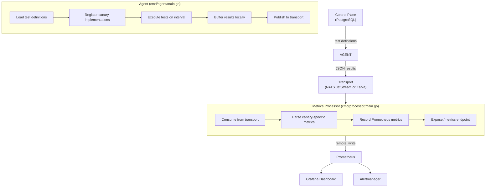
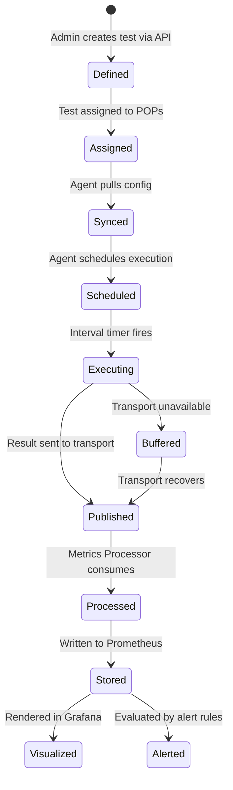

# NetVantage Canary Developer Guide

This guide is for Go developers who want to understand, extend, or contribute new synthetic test types (canaries) to NetVantage. By the end, you'll understand the architecture, implement a complete new canary type end-to-end, and integrate it with the metrics processor and Prometheus.

## Table of Contents

1. [Architecture Overview](#architecture-overview)
2. [The Canary Interface](#the-canary-interface)
3. [TestDefinition and Result Structures](#testdefinition-and-result-structures)
4. [Implementing a New Canary Type](#implementing-a-new-canary-type)
5. [Configuration Validation](#configuration-validation)
6. [Error Handling](#error-handling)
7. [Context Cancellation](#context-cancellation)
8. [Integrating with the Metrics Processor](#integrating-with-the-metrics-processor)
9. [Prometheus Metrics](#prometheus-metrics)
10. [Grafana Dashboards](#grafana-dashboards)
11. [Alert Rules](#alert-rules)
12. [Testing](#testing)
13. [Registration and Compilation](#registration-and-compilation)
14. [Complete Example: TCP Port Check Canary](#complete-example-tcp-port-check-canary)

---

## Architecture Overview

NetVantage's canary system follows this flow:



**Key design decision:** Canaries are compiled into the agent binary as Go interfaces — NOT via Go's `plugin.Open` system. This avoids version coupling, testing complexity, and fragility. Community extensions use build tags or fork-and-compile.

### Why This Architecture?

- **Simplicity:** Each canary is a small, focused package with a single interface.
- **Testability:** All canaries are testable with unit tests and in-memory transports.
- **Extensibility:** Adding a new canary requires no changes to the core agent loop.
- **Observability:** Every canary ships with Prometheus metrics, alert rules, and a Grafana dashboard.

### Test Lifecycle



---

## The Canary Interface

All synthetic test types implement the `canary.Canary` interface defined in `internal/agent/canary/canary.go`:

```go
type Canary interface {
    // Type returns the canary type identifier (e.g., "ping", "dns", "http").
    Type() string

    // Execute runs the synthetic test and returns a Result.
    // Must respect context cancellation for graceful shutdown.
    Execute(ctx context.Context, test TestDefinition) (*Result, error)

    // Validate checks whether the canary-specific configuration is valid.
    // Called once at config load time, not per-execution.
    Validate(config json.RawMessage) error
}
```

### Type()

Returns a string identifier for the canary type. Examples: `"ping"`, `"dns"`, `"http"`, `"traceroute"`.

Used to:
- Route test definitions to the correct canary implementation
- Label metrics and alert rules
- Name transport topics (e.g., `netvantage.ping.results`)

```go
func (c *Canary) Type() string {
    return "mytest"
}
```

### Execute()

The core method. Receives a `TestDefinition`, executes the synthetic test, and returns a `Result`.

Contract:
- Must respect `ctx.Done()` for graceful shutdown; return `ctx.Err()` if cancelled
- Always return a `Result` (even on failure) or an error
- Use `Result.Success = false` for test failures (HTTP 500); use error returns for system/parsing errors
- Never panic — always return an error
- Measurement starts now; errors occur when the test cannot run (permission, parsing, I/O)

### Validate()

Called once when the test definition is loaded. Checks canary-specific config for validity.

Contract:
- Returns `nil` if valid
- Returns a descriptive error if invalid (e.g., `"invalid payload_size: must be 0–65535"`)
- Called before `Execute()`, so you can trust config is valid in Execute

---

## TestDefinition and Result Structures

### TestDefinition

Passed to `Execute()` by the agent. Describes the synthetic test to run.

```go
type TestDefinition struct {
    ID       string          `json:"test_id"`       // Unique test identifier (from control plane)
    Type     string          `json:"test_type"`     // Canary type: "ping", "dns", etc.
    Target   string          `json:"target"`        // Host, URL, or IP to test
    Interval time.Duration   `json:"interval"`      // How often to run (e.g., 60s)
    Timeout  time.Duration   `json:"timeout"`       // Max time for a single execution (e.g., 10s)
    Config   json.RawMessage `json:"config"`        // Canary-specific config (opaque JSON)
}
```

**Field semantics:**

- **ID:** Uniquely identifies this test across the control plane and transport. Included in every `Result` for correlation.
- **Type:** Determines which canary implementation handles this test.
- **Target:** Host, URL, or IP. Semantics depend on the canary type (ping: IP/hostname, HTTP: full URL, DNS: domain name).
- **Interval:** How often the agent should execute this test. The agent schedules each test independently.
- **Timeout:** Maximum time for a single execution. Pass to your underlying syscall/library (e.g., `pinger.Timeout`).
- **Config:** Canary-type-specific options. Unmarshal in `Execute()` or reject in `Validate()`.

### Result

Returned from `Execute()`. Represents the outcome of a single test execution.

```go
type Result struct {
    TestID     string            `json:"test_id"`     // Reference to the TestDefinition
    AgentID    string            `json:"agent_id"`    // Agent that executed the test
    POPName    string            `json:"pop_name"`    // Point of Presence name
    TestType   string            `json:"test_type"`   // Canary type that produced result
    Target     string            `json:"target"`      // Host/URL tested
    Timestamp  time.Time         `json:"timestamp"`   // When execution started (UTC)
    DurationMS float64           `json:"duration_ms"` // Total execution time in milliseconds
    Success    bool              `json:"success"`     // Whether test passed all assertions
    Metrics    json.RawMessage   `json:"metrics"`     // Canary-type-specific metrics (JSON)
    Error      string            `json:"error,omitempty"` // Error message if failed
    Metadata   map[string]string `json:"metadata,omitempty"` // Optional tags, versions, etc.
}
```

**Field semantics:**

- **Success:** `true` if the test passed all assertions (e.g., got 200 OK, packet loss < 100%). Drives alerting.
- **Metrics:** JSON object with canary-type-specific measurements (RTT, status code, etc.). The processor parses this.
- **Error:** Human-readable error message if `Success == false` or execution failed.
- **DurationMS:** Elapsed time from start of test to end (excluding agent overhead).
- **Metadata:** Optional key-value pairs for extra context (e.g., `{"tls_version": "TLSv1.3"}`, `{"agent_version": "v1.2.3"}`).

**Set the Agent, POP, and TestType fields in the canary's main agent loop** — the canary implementation doesn't set them. Here's why: multiple canary instances may be executing concurrently, and the agent orchestrates the assignments.

> **⚠️ Important: Two TestDefinition Structs Exist**
>
> The codebase has two `TestDefinition` structs with different field types for timing:
>
> - **`internal/agent/canary/canary.TestDefinition`** — Used by canary implementations. Timing fields use Go's `time.Duration` (`Interval`, `Timeout`). This is what your canary's `Execute()` method receives.
> - **`internal/domain/models.TestDefinition`** — Used by the Control Plane API and database layer. Timing fields use `int64` milliseconds (`IntervalMS`, `TimeoutMS`). This is what the REST API accepts and stores.
>
> The agent's config sync layer converts between the two: it receives the domain model from the API (with `IntervalMS`/`TimeoutMS` in milliseconds) and converts to the canary model (with `Interval`/`Timeout` as `time.Duration`) before passing to `Execute()`. You don't need to handle this conversion yourself — just use `test.Timeout` as a `time.Duration` in your canary implementation.

---

## Implementing a New Canary Type

Let's walk through building a real canary from scratch. We'll use **TCP Port Check** as an example (tests TCP connectivity to a target host and port).

### 1. Create the Package Structure

```bash
mkdir -p internal/agent/canary/tcpcheck
touch internal/agent/canary/tcpcheck/{tcpcheck.go,config.go,tcpcheck_test.go}
```

### 2. Define Configuration (config.go)

```go
// Package tcpcheck implements TCP port connectivity testing.
package tcpcheck

import "time"

// Config holds TCP check specific configuration.
type Config struct {
    // Port to connect to (default: inferred from target, e.g., "example.com:443").
    Port string `json:"port"`

    // Timeout for a single connection attempt (default: 5s).
    ConnectTimeout time.Duration `json:"connect_timeout"`

    // Number of connection attempts (default: 1). Higher values test stability.
    Attempts int `json:"attempts"`

    // Delay between attempts (default: 100ms).
    AttemptInterval time.Duration `json:"attempt_interval"`
}

func DefaultConfig() Config {
    return Config{
        Port:             "",
        ConnectTimeout:   5 * time.Second,
        Attempts:         1,
        AttemptInterval:  100 * time.Millisecond,
    }
}

// Metrics holds the results of a single TCP check execution.
type Metrics struct {
    ConnectTimeMS float64  `json:"connect_time_ms"`    // Avg connection time
    MinTimeMS     float64  `json:"min_time_ms"`        // Fastest connection
    MaxTimeMS     float64  `json:"max_time_ms"`        // Slowest connection
    SuccessCount  int      `json:"success_count"`      // Successful connections
    FailureCount  int      `json:"failure_count"`      // Failed connections
    SuccessRatio  float64  `json:"success_ratio"`      // Ratio of successful attempts
    FirstError    string   `json:"first_error,omitempty"` // First error encountered (if any)
}
```

**Key patterns:**

- Use `time.Duration` for timing fields (supports JSON marshaling with nanosecond precision).
- Provide sensible defaults via `DefaultConfig()`.
- Use plural field names (e.g., `Attempts` not `Attempt`) to indicate repetition.
- Include ratio fields (0.0–1.0) for Prometheus gauges.
- Use `omitempty` for optional error fields.

### 3. Implement the Canary (tcpcheck.go)

```go
package tcpcheck

import (
    "context"
    "encoding/json"
    "fmt"
    "net"
    "strings"
    "time"

    "github.com/netvantage/netvantage/internal/agent/canary"
)

// Canary implements the TCP port check canary.
type Canary struct{}

// New creates a new TCP check canary.
func New() *Canary {
    return &Canary{}
}

// Type returns "tcpcheck".
func (c *Canary) Type() string {
    return "tcpcheck"
}

// Validate checks that the TCP check configuration is valid.
func (c *Canary) Validate(config json.RawMessage) error {
    if len(config) == 0 {
        return nil // Defaults are fine.
    }

    var cfg Config
    if err := json.Unmarshal(config, &cfg); err != nil {
        return fmt.Errorf("tcpcheck: invalid config: %w", err)
    }

    if cfg.Attempts < 1 {
        return fmt.Errorf("tcpcheck: attempts must be >= 1, got %d", cfg.Attempts)
    }
    if cfg.ConnectTimeout < 100*time.Millisecond {
        return fmt.Errorf("tcpcheck: connect_timeout must be >= 100ms")
    }
    if cfg.AttemptInterval < 0 {
        return fmt.Errorf("tcpcheck: attempt_interval must be non-negative")
    }

    return nil
}

// Execute runs a TCP connection check to the target.
func (c *Canary) Execute(ctx context.Context, test canary.TestDefinition) (*canary.Result, error) {
    cfg := DefaultConfig()
    if len(test.Config) > 0 {
        if err := json.Unmarshal(test.Config, &cfg); err != nil {
            return nil, fmt.Errorf("tcpcheck: parse config: %w", err)
        }
    }

    // Infer port from target if not specified.
    target := test.Target
    if cfg.Port != "" {
        // If port is explicitly set, use it as target:port.
        if !strings.Contains(target, ":") {
            target = net.JoinHostPort(target, cfg.Port)
        }
    } else if !strings.Contains(target, ":") {
        // No port in target and no explicit port — default to 80.
        target = net.JoinHostPort(target, "80")
    }

    start := time.Now()
    var (
        times        []float64
        successCount int
        failureCount int
        firstError   string
    )

    // Execute multiple attempts.
    for attempt := 0; attempt < cfg.Attempts; attempt++ {
        if attempt > 0 {
            // Wait before next attempt.
            select {
            case <-time.After(cfg.AttemptInterval):
            case <-ctx.Done():
                return nil, ctx.Err()
            }
        }

        // Dial with context and timeout.
        connCtx, cancel := context.WithTimeout(ctx, cfg.ConnectTimeout)
        attemptStart := time.Now()

        dialer := net.Dialer{}
        conn, err := dialer.DialContext(connCtx, "tcp", target)
        cancel()

        attemptDuration := time.Since(attemptStart).Seconds() * 1000

        if err != nil {
            failureCount++
            if firstError == "" {
                firstError = err.Error()
            }
            times = append(times, attemptDuration)
            continue
        }
        conn.Close()

        successCount++
        times = append(times, attemptDuration)
    }

    elapsed := time.Since(start)

    // Compute metrics.
    minTime := findMin(times)
    maxTime := findMax(times)
    avgTime := findAvg(times)

    metrics := Metrics{
        ConnectTimeMS: avgTime,
        MinTimeMS:     minTime,
        MaxTimeMS:     maxTime,
        SuccessCount:  successCount,
        FailureCount:  failureCount,
        SuccessRatio:  float64(successCount) / float64(cfg.Attempts),
        FirstError:    firstError,
    }

    metricsJSON, err := json.Marshal(metrics)
    if err != nil {
        return nil, fmt.Errorf("tcpcheck: marshal metrics: %w", err)
    }

    // Test is successful if at least one attempt succeeded.
    success := successCount > 0

    return &canary.Result{
        TestID:     test.ID,
        TestType:   "tcpcheck",
        Target:     test.Target,
        Timestamp:  start.UTC(),
        DurationMS: float64(elapsed.Milliseconds()),
        Success:    success,
        Metrics:    metricsJSON,
        Error:      firstError,
    }, nil
}

// Helper functions for computing stats.
func findMin(times []float64) float64 {
    if len(times) == 0 {
        return 0
    }
    min := times[0]
    for _, t := range times[1:] {
        if t < min {
            min = t
        }
    }
    return min
}

func findMax(times []float64) float64 {
    if len(times) == 0 {
        return 0
    }
    max := times[0]
    for _, t := range times[1:] {
        if t > max {
            max = t
        }
    }
    return max
}

func findAvg(times []float64) float64 {
    if len(times) == 0 {
        return 0
    }
    var sum float64
    for _, t := range times {
        sum += t
    }
    return sum / float64(len(times))
}
```

**Key implementation patterns:**

1. **Context handling:** Wrap context-aware operations (dialing, timeouts) with the passed context.
2. **Error vs. failure:** Parse errors → `fmt.Errorf()` return. Test failures → `Result{Success: false}`.
3. **Timing:** Use `time.Since()` for precise measurement.
4. **JSON serialization:** Marshal metrics to `json.RawMessage` for transport.
5. **Configuration defaults:** Apply defaults inline if not provided.
6. **Graceful degradation:** Record partial results even if some attempts fail.

---

## Configuration Validation

The `Validate()` method is called once when a test definition is loaded. Use it to catch configuration errors early, before execution.

### Pattern: Reject Invalid Config

```go
func (c *Canary) Validate(config json.RawMessage) error {
    if len(config) == 0 {
        return nil // Defaults are fine
    }

    var cfg Config
    if err := json.Unmarshal(config, &cfg); err != nil {
        return fmt.Errorf("mytest: invalid config: %w", err)
    }

    // Validate individual fields.
    if cfg.Count < 1 {
        return fmt.Errorf("mytest: count must be >= 1, got %d", cfg.Count)
    }
    if cfg.Timeout < 100*time.Millisecond {
        return fmt.Errorf("mytest: timeout must be >= 100ms")
    }

    // Validate regex patterns.
    if cfg.Pattern != "" {
        if _, err := regexp.Compile(cfg.Pattern); err != nil {
            return fmt.Errorf("mytest: invalid pattern: %w", err)
        }
    }

    return nil
}
```

### When to Validate

- **At load time:** In `Validate()` — reject before the agent runs tests.
- **At execution time:** In `Execute()` — for dynamic checks (e.g., network availability, permission checks).

### Error Message Guidelines

- Start with the canary type for clarity: `"mytest: ..."`
- Include the invalid value in the message: `"expected 1–100, got 200"`
- Wrap underlying errors: `fmt.Errorf("parse config: %w", err)`

---

## Error Handling

NetVantage distinguishes two failure modes:

1. **Test Failure:** The test ran, but the target failed the assertion (e.g., HTTP 500, packet loss 100%). Return `Result{Success: false, Error: "..."}`.
2. **Execution Error:** The test could not run (permission denied, invalid config, network unreachable). Return `error`.

### Pattern: Test Failure

```go
// Target is reachable but returned an error status.
return &canary.Result{
    TestID:     test.ID,
    TestType:   "mytest",
    Target:     test.Target,
    Timestamp:  start.UTC(),
    DurationMS: float64(elapsed.Milliseconds()),
    Success:    false,
    Error:      "HTTP 500 Internal Server Error",
    Metrics:    metricsJSON,
}, nil
```

### Pattern: Execution Error

```go
// Could not even attempt the test (permission, parsing, etc.).
if !hasCapability("CAP_NET_RAW") {
    return nil, fmt.Errorf("mytest: missing CAP_NET_RAW capability")
}
```

### Rule of Thumb

- **Did you measure something?** → Return `Result{Success: ...}` with metrics.
- **Could not measure anything?** → Return `error`.

---

## Context Cancellation

The agent may cancel the test's context during graceful shutdown. Always respect `ctx.Done()`.

### Pattern: Respect Context in Long-Running Operations

```go
// Create a context with timeout for the operation.
opCtx, cancel := context.WithTimeout(ctx, cfg.Timeout)
defer cancel()

// Perform I/O with the context.
conn, err := dialer.DialContext(opCtx, "tcp", target)

// Check for cancellation.
select {
case <-ctx.Done():
    // Graceful shutdown requested.
    return nil, ctx.Err()
case <-time.After(delay):
    // Normal timeout.
    return &canary.Result{...}, nil
}
```

### Pattern: Goroutines

If you spawn goroutines, always clean them up before returning:

```go
done := make(chan error, 1)
go func() {
    done <- someBlockingOperation()
}()

select {
case <-ctx.Done():
    // Shutdown requested; wait for goroutine to finish.
    <-done
    return nil, ctx.Err()
case err := <-done:
    if err != nil {
        return nil, fmt.Errorf("operation failed: %w", err)
    }
}
```

---

## Integrating with the Metrics Processor

The **Metrics Processor** (`cmd/processor/main.go`) consumes test results from the transport and converts them into Prometheus metrics.

For each canary type, the processor:

1. Subscribes to `netvantage.<type>.results` (e.g., `netvantage.tcpcheck.results`)
2. Unmarshals the JSON result
3. Extracts canary-specific metrics from `Result.Metrics`
4. Records Prometheus gauges/counters
5. Logs the result

### Adding a Processor Handler for Your Canary

Edit `internal/processor/processor.go`:

**Step 1: Define a metrics struct that mirrors your canary's Metrics.**

```go
// tcpcheckMetrics mirrors the Metrics struct from the tcpcheck canary package.
type tcpcheckMetrics struct {
    ConnectTimeMS float64 `json:"connect_time_ms"`
    MinTimeMS     float64 `json:"min_time_ms"`
    MaxTimeMS     float64 `json:"max_time_ms"`
    SuccessCount  int     `json:"success_count"`
    FailureCount  int     `json:"failure_count"`
    SuccessRatio  float64 `json:"success_ratio"`
    FirstError    string  `json:"first_error,omitempty"`
}
```

**Step 2: Add Prometheus metrics to the Processor struct.**

```go
type Processor struct {
    // ... existing fields ...

    // TCP check metrics.
    tcpcheckConnectTime *prometheus.GaugeVec
    tcpcheckSuccessRatio *prometheus.GaugeVec
}
```

**Step 3: Initialize the metrics in New().**

```go
p := &Processor{
    // ... existing initialization ...

    tcpcheckConnectTime: prometheus.NewGaugeVec(prometheus.GaugeOpts{
        Name: "netvantage_tcpcheck_connect_time_seconds",
        Help: "TCP connection time in seconds",
    }, []string{"target", "pop", "agent_id"}),

    tcpcheckSuccessRatio: prometheus.NewGaugeVec(prometheus.GaugeOpts{
        Name: "netvantage_tcpcheck_success_ratio",
        Help: "TCP check success ratio (0.0–1.0)",
    }, []string{"target", "pop", "agent_id"}),
}

// Register with Prometheus.
reg.MustRegister(p.tcpcheckConnectTime)
reg.MustRegister(p.tcpcheckSuccessRatio)
```

**Step 4: Subscribe to the results topic in Run().**

```go
go func() {
    if err := p.consumer.Subscribe(ctx, "netvantage.tcpcheck.results", p.handleTCPCheckResult); err != nil {
        p.logger.Error("tcpcheck subscription error", "error", err)
    }
}()
```

**Step 5: Implement the handler.**

```go
// handleTCPCheckResult processes a single TCP check result from the transport.
func (p *Processor) handleTCPCheckResult(_ context.Context, msg []byte) error {
    var result canary.Result
    if err := json.Unmarshal(msg, &result); err != nil {
        p.processingErrors.WithLabelValues("tcpcheck", "unmarshal").Inc()
        p.logger.Error("failed to unmarshal tcpcheck result", "error", err)
        return nil
    }

    p.resultsProcessed.WithLabelValues("tcpcheck", result.POPName).Inc()

    var metrics tcpcheckMetrics
    if err := json.Unmarshal(result.Metrics, &metrics); err != nil {
        p.processingErrors.WithLabelValues("tcpcheck", "metrics_unmarshal").Inc()
        p.logger.Error("failed to unmarshal tcpcheck metrics", "error", err, "test_id", result.TestID)
        return nil
    }

    labels := []string{result.Target, result.POPName, result.AgentID}

    // Convert milliseconds to seconds for Prometheus conventions.
    p.tcpcheckConnectTime.WithLabelValues(labels...).Set(metrics.ConnectTimeMS / 1000.0)
    p.tcpcheckSuccessRatio.WithLabelValues(labels...).Set(metrics.SuccessRatio)

    p.logger.Debug("processed tcpcheck result",
        "target", result.Target,
        "pop", result.POPName,
        "connect_time_ms", fmt.Sprintf("%.2f", metrics.ConnectTimeMS),
        "success_ratio", fmt.Sprintf("%.1f%%", metrics.SuccessRatio*100),
    )

    return nil
}
```

### Key Patterns

- **Avoid circular imports:** Define metric structs in processor.go, not in the canary package.
- **Convert units:** Canary metrics often use milliseconds; Prometheus conventions use seconds. Divide by 1000.
- **Label consistency:** Use `target`, `pop`, `agent_id` as base labels for all test results.
- **Error resilience:** Return `nil` from handlers even on unmarshal errors — malformed messages won't fix themselves.

---

## Prometheus Metrics

All metrics must use the `netvantage_` prefix and follow Prometheus conventions.

### Naming Convention

```
netvantage_<canary_type>_<measurement>_<unit>
```

Examples:
- `netvantage_ping_rtt_seconds` (Gauge)
- `netvantage_ping_packet_loss_ratio` (Gauge)
- `netvantage_traceroute_path_change_total` (Counter)
- `netvantage_http_cert_expiry_days` (Gauge)

### Metric Types

- **Gauge:** Instantaneous value (RTT, packet loss, connection time). Updated on every test.
- **Counter:** Monotonically increasing value (total path changes, total retries). Only incremented.
- **Histogram:** Distribution of values. Use for timing data that needs percentile tracking (p50, p95, p99).

For TCP check:
- `netvantage_tcpcheck_connect_time_seconds` (Gauge) — current connection time
- `netvantage_tcpcheck_success_ratio` (Gauge) — success ratio from latest test

### Unit Conventions

- **Time:** seconds (not milliseconds, not nanoseconds)
- **Ratios:** 0.0–1.0 (not percentages)
- **Counts:** dimensionless (use `_total` suffix for counters)

### Label Strategy

Consistent labels across all metrics:

```
target       # The host/URL/IP being tested
pop          # Point of Presence name
agent_id     # Agent identifier
<canary-specific>  # Additional labels (e.g., "stat" for min/avg/max)
```

Example query: `netvantage_ping_rtt_seconds{target="google.com", pop="us-west-2", stat="avg"}`

---

## Grafana Dashboards

Every canary ships with a dashboard. Dashboards are provisioned as code (JSON) so they're version-controlled and reproducible.

### Location

Place dashboard JSON at `grafana/dashboards/canary-<type>-dashboard.json`.

### Creating a Dashboard

1. **In Grafana UI:** Build the dashboard with panels, queries, and annotations.
2. **Export:** Go to Dashboard Settings → JSON Model → Copy JSON.
3. **Simplify:** Edit to remove volatile fields (UIDs, creation timestamps, version numbers).
4. **Version control:** Check in to git.

### Minimal Dashboard Example (TCP Check)

```json
{
  "dashboard": {
    "title": "TCP Check Overview",
    "tags": ["netvantage", "tcpcheck"],
    "timezone": "browser",
    "panels": [
      {
        "title": "Connection Time (p50, p95, p99)",
        "targets": [
          {
            "expr": "netvantage_tcpcheck_connect_time_seconds{target=\"$target\", pop=\"$pop\"}"
          }
        ],
        "type": "graph"
      },
      {
        "title": "Success Ratio",
        "targets": [
          {
            "expr": "netvantage_tcpcheck_success_ratio{target=\"$target\", pop=\"$pop\"}"
          }
        ],
        "type": "stat"
      }
    ],
    "templating": {
      "list": [
        {
          "name": "target",
          "query": "label_values(netvantage_tcpcheck_connect_time_seconds, target)",
          "type": "query"
        },
        {
          "name": "pop",
          "query": "label_values(netvantage_tcpcheck_connect_time_seconds, pop)",
          "type": "query"
        }
      ]
    }
  }
}
```

### Dashboard Best Practices

- **Templating:** Use variables (`$target`, `$pop`) for drill-down navigation.
- **Consistent styling:** Use the same color scheme and panel layout as other canary dashboards.
- **Single responsibility:** One dashboard per canary type, covering all aspects of that test.
- **Alert integration:** Link dashboards to alert rules via annotations.

---

## Alert Rules

Define Prometheus alert rules for your canary. These fire notifications to Slack, PagerDuty, email, or webhooks.

### Location

Place alert rules at `prometheus/rules/alerts-<type>.yml`.

### Alert Rule Example (TCP Check)

```yaml
groups:
  - name: tcpcheck
    interval: 30s
    rules:
      # Alert when connection time exceeds 500ms.
      - alert: NetVantageTCPCheckHighLatency
        expr: netvantage_tcpcheck_connect_time_seconds{job="netvantage"} > 0.5
        for: 2m
        annotations:
          summary: "TCP check high latency on {{ $labels.target }}"
          description: "Target {{ $labels.target }} at {{ $labels.pop }} has connection time {{ $value }}s (threshold: 0.5s)"

      # Alert when success ratio drops below 50%.
      - alert: NetVantageTCPCheckFailureRate
        expr: netvantage_tcpcheck_success_ratio{job="netvantage"} < 0.5
        for: 1m
        annotations:
          summary: "TCP check failure rate high on {{ $labels.target }}"
          description: "Target {{ $labels.target }} at {{ $labels.pop }} has success ratio {{ $value }} (threshold: 0.5)"
```

### Alert Rule Naming

```
NetVantage<CanaryType><Condition>
```

Examples:
- `NetVantagePingHighLatency`
- `NetVantageTCPCheckFailureRate`
- `NetVantageHTTPCertExpiry`

### Alert Annotations

- **summary:** One-line description. Use template variables like `{{ $labels.target }}`.
- **description:** Detailed explanation with threshold and current value.
- **runbook_url:** (Optional) Link to runbook for manual remediation.

---

## Testing

NetVantage canaries use **table-driven tests** for comprehensive coverage.

### Pattern: Table-Driven Config Tests

```go
func TestConfigValidation(t *testing.T) {
    tests := []struct {
        name    string
        config  string
        wantErr bool
    }{
        {
            name:    "valid config",
            config:  `{"attempts":3,"connect_timeout":5000000000}`,
            wantErr: false,
        },
        {
            name:    "invalid attempts",
            config:  `{"attempts":0}`,
            wantErr: true,
        },
        {
            name:    "empty config uses defaults",
            config:  `{}`,
            wantErr: false,
        },
    }

    c := New()
    for _, tt := range tests {
        t.Run(tt.name, func(t *testing.T) {
            err := c.Validate([]byte(tt.config))
            if (err != nil) != tt.wantErr {
                t.Errorf("Validate() error = %v, wantErr %v", err, tt.wantErr)
            }
        })
    }
}
```

### Pattern: Execute Tests

```go
func TestExecute(t *testing.T) {
    tests := []struct {
        name          string
        target        string
        config        string
        expectSuccess bool
    }{
        {
            name:          "loopback always succeeds",
            target:        "127.0.0.1:22",
            config:        `{"attempts":1}`,
            expectSuccess: true, // Assume SSH is running locally
        },
        {
            name:          "invalid host fails",
            target:        "invalid-host-xyz-123.test:80",
            config:        `{"attempts":1}`,
            expectSuccess: false,
        },
    }

    c := New()
    for _, tt := range tests {
        t.Run(tt.name, func(t *testing.T) {
            testDef := canary.TestDefinition{
                ID:      "test-1",
                Type:    "tcpcheck",
                Target:  tt.target,
                Timeout: 10 * time.Second,
                Config:  []byte(tt.config),
            }

            ctx, cancel := context.WithTimeout(context.Background(), 15*time.Second)
            defer cancel()

            result, err := c.Execute(ctx, testDef)

            if err != nil {
                t.Fatalf("Execute() error = %v", err)
            }

            if result.Success != tt.expectSuccess {
                t.Errorf("Expected Success=%v, got %v", tt.expectSuccess, result.Success)
            }

            // Verify metrics are present.
            if len(result.Metrics) == 0 {
                t.Error("Metrics should not be empty")
            }

            var m Metrics
            if err := json.Unmarshal(result.Metrics, &m); err != nil {
                t.Fatalf("Failed to unmarshal metrics: %v", err)
            }

            if m.ConnectTimeMS < 0 {
                t.Error("ConnectTimeMS should be non-negative")
            }
        })
    }
}
```

### Pattern: Context Cancellation Tests

```go
func TestContextCancellation(t *testing.T) {
    c := New()
    testDef := canary.TestDefinition{
        ID:      "test-1",
        Type:    "tcpcheck",
        Target:  "example.com:80",
        Timeout: 30 * time.Second,
        Config:  []byte(`{}`),
    }

    // Cancel context immediately.
    ctx, cancel := context.WithCancel(context.Background())
    cancel()

    result, err := c.Execute(ctx, testDef)

    if err != context.Canceled {
        t.Errorf("Expected context.Canceled, got %v", err)
    }

    if result != nil {
        t.Error("Result should be nil when context is cancelled")
    }
}
```

### Running Tests

```bash
# Unit tests only (fast, no Docker).
go test ./internal/agent/canary/tcpcheck/...

# Unit tests with coverage.
go test -cover ./internal/agent/canary/tcpcheck/...

# Run a specific test.
go test -run TestExecute ./internal/agent/canary/tcpcheck/

# E2E pipeline tests — verifies your canary through real NATS JetStream (requires Docker).
go test -v -race -tags=e2e -timeout=10m ./tests/e2e/...

# Or use the Taskfile shortcuts:
task test       # All unit tests
task test-e2e   # All E2E tests (testcontainers)
```

---

## Registration and Compilation

To add your canary to the agent binary, register it in `cmd/agent/main.go`.

### Step 1: Import Your Canary Package

```go
import (
    // ... existing imports ...
    tcpcheckCanary "github.com/netvantage/netvantage/internal/agent/canary/tcpcheck"
)
```

### Step 2: Register in main()

```go
func main() {
    logger := slog.New(slog.NewJSONHandler(os.Stdout, &slog.HandlerOptions{
        Level: slog.LevelInfo,
    }))

    cfg := config.DefaultConfig()
    // ... config loading ...

    transport, err := natsTransport.New(natsTransport.Config{
        URL: cfg.Transport.NATS.URL,
    }, logger)
    if err != nil {
        logger.Error("failed to connect to transport", "error", err)
        os.Exit(1)
    }
    defer transport.Close()

    buf := buffer.NewMemoryBuffer(cfg.Buffer.MaxSizeBytes)

    a := agent.New(cfg, transport, buf, logger)

    // Register canary types.
    a.RegisterCanary(ping.New())
    a.RegisterCanary(dnsCanary.New())
    a.RegisterCanary(httpCanary.New())
    a.RegisterCanary(trCanary.New())
    a.RegisterCanary(tcpcheckCanary.New())  // <- Add your canary here

    ctx, stop := signal.NotifyContext(context.Background(), syscall.SIGINT, syscall.SIGTERM)
    defer stop()

    if err := a.Run(ctx); err != nil {
        logger.Error("agent exited with error", "error", err)
        os.Exit(1)
    }
}
```

### Step 3: Build and Test

```bash
# Build the agent binary.
go build -o netvantage-agent ./cmd/agent

# Run the agent (requires configuration).
./netvantage-agent --config agent.yaml

# Run all tests to ensure no regressions.
go test ./...
```

---

## Complete Example: TCP Port Check Canary

Here's the full implementation of a production-ready TCP port check canary:

### File: internal/agent/canary/tcpcheck/config.go

```go
package tcpcheck

import "time"

// Config holds TCP check specific configuration.
type Config struct {
    // Port to connect to. If empty, inferred from target or defaults to 80.
    Port string `json:"port"`

    // Timeout for a single connection attempt (default: 5s).
    ConnectTimeout time.Duration `json:"connect_timeout"`

    // Number of connection attempts (default: 1).
    Attempts int `json:"attempts"`

    // Delay between attempts (default: 100ms).
    AttemptInterval time.Duration `json:"attempt_interval"`
}

func DefaultConfig() Config {
    return Config{
        Port:             "",
        ConnectTimeout:   5 * time.Second,
        Attempts:         1,
        AttemptInterval:  100 * time.Millisecond,
    }
}

// Metrics holds the results of a single TCP check execution.
type Metrics struct {
    // Connection timings in milliseconds.
    ConnectTimeMS float64 `json:"connect_time_ms"`
    MinTimeMS     float64 `json:"min_time_ms"`
    MaxTimeMS     float64 `json:"max_time_ms"`

    // Attempt counters.
    SuccessCount int `json:"success_count"`
    FailureCount int `json:"failure_count"`

    // Ratio of successful attempts (0.0–1.0).
    SuccessRatio float64 `json:"success_ratio"`

    // First error encountered (if any).
    FirstError string `json:"first_error,omitempty"`
}
```

### File: internal/agent/canary/tcpcheck/tcpcheck.go

```go
package tcpcheck

import (
    "context"
    "encoding/json"
    "fmt"
    "net"
    "strings"
    "time"

    "github.com/netvantage/netvantage/internal/agent/canary"
)

// Canary implements the TCP port check canary.
type Canary struct{}

// New creates a new TCP check canary.
func New() *Canary {
    return &Canary{}
}

// Type returns "tcpcheck".
func (c *Canary) Type() string {
    return "tcpcheck"
}

// Validate checks that the TCP check configuration is valid.
func (c *Canary) Validate(config json.RawMessage) error {
    if len(config) == 0 {
        return nil // Defaults are fine.
    }

    var cfg Config
    if err := json.Unmarshal(config, &cfg); err != nil {
        return fmt.Errorf("tcpcheck: invalid config: %w", err)
    }

    if cfg.Attempts < 1 {
        return fmt.Errorf("tcpcheck: attempts must be >= 1, got %d", cfg.Attempts)
    }
    if cfg.ConnectTimeout < 100*time.Millisecond {
        return fmt.Errorf("tcpcheck: connect_timeout must be >= 100ms")
    }
    if cfg.AttemptInterval < 0 {
        return fmt.Errorf("tcpcheck: attempt_interval must be non-negative")
    }

    return nil
}

// Execute runs a TCP connection check to the target.
func (c *Canary) Execute(ctx context.Context, test canary.TestDefinition) (*canary.Result, error) {
    cfg := DefaultConfig()
    if len(test.Config) > 0 {
        if err := json.Unmarshal(test.Config, &cfg); err != nil {
            return nil, fmt.Errorf("tcpcheck: parse config: %w", err)
        }
    }

    // Infer port from target if not specified.
    target := test.Target
    if cfg.Port != "" {
        if !strings.Contains(target, ":") {
            target = net.JoinHostPort(target, cfg.Port)
        }
    } else if !strings.Contains(target, ":") {
        // No port in target and no explicit port — default to 80.
        target = net.JoinHostPort(target, "80")
    }

    start := time.Now()
    var (
        times        []float64
        successCount int
        failureCount int
        firstError   string
    )

    dialer := net.Dialer{}

    // Execute multiple attempts.
    for attempt := 0; attempt < cfg.Attempts; attempt++ {
        if attempt > 0 {
            // Wait before next attempt.
            select {
            case <-time.After(cfg.AttemptInterval):
            case <-ctx.Done():
                return nil, ctx.Err()
            }
        }

        // Dial with context and timeout.
        connCtx, cancel := context.WithTimeout(ctx, cfg.ConnectTimeout)
        attemptStart := time.Now()

        conn, err := dialer.DialContext(connCtx, "tcp", target)
        cancel()

        attemptDuration := time.Since(attemptStart).Seconds() * 1000

        if err != nil {
            failureCount++
            if firstError == "" {
                firstError = err.Error()
            }
            times = append(times, attemptDuration)
            continue
        }
        conn.Close()

        successCount++
        times = append(times, attemptDuration)
    }

    elapsed := time.Since(start)

    // Compute metrics.
    minTime := findMin(times)
    maxTime := findMax(times)
    avgTime := findAvg(times)

    metrics := Metrics{
        ConnectTimeMS: avgTime,
        MinTimeMS:     minTime,
        MaxTimeMS:     maxTime,
        SuccessCount:  successCount,
        FailureCount:  failureCount,
        SuccessRatio:  float64(successCount) / float64(cfg.Attempts),
        FirstError:    firstError,
    }

    metricsJSON, err := json.Marshal(metrics)
    if err != nil {
        return nil, fmt.Errorf("tcpcheck: marshal metrics: %w", err)
    }

    // Test is successful if at least one attempt succeeded.
    success := successCount > 0

    return &canary.Result{
        TestID:     test.ID,
        TestType:   "tcpcheck",
        Target:     test.Target,
        Timestamp:  start.UTC(),
        DurationMS: float64(elapsed.Milliseconds()),
        Success:    success,
        Metrics:    metricsJSON,
        Error:      firstError,
    }, nil
}

func findMin(times []float64) float64 {
    if len(times) == 0 {
        return 0
    }
    min := times[0]
    for _, t := range times[1:] {
        if t < min {
            min = t
        }
    }
    return min
}

func findMax(times []float64) float64 {
    if len(times) == 0 {
        return 0
    }
    max := times[0]
    for _, t := range times[1:] {
        if t > max {
            max = t
        }
    }
    return max
}

func findAvg(times []float64) float64 {
    if len(times) == 0 {
        return 0
    }
    var sum float64
    for _, t := range times {
        sum += t
    }
    return sum / float64(len(times))
}
```

### File: internal/agent/canary/tcpcheck/tcpcheck_test.go

```go
package tcpcheck

import (
    "context"
    "encoding/json"
    "testing"
    "time"

    "github.com/netvantage/netvantage/internal/agent/canary"
)

func TestType(t *testing.T) {
    c := New()
    if got := c.Type(); got != "tcpcheck" {
        t.Errorf("Type() = %q, want %q", got, "tcpcheck")
    }
}

func TestValidate(t *testing.T) {
    tests := []struct {
        name    string
        config  string
        wantErr bool
    }{
        {
            name:    "empty config uses defaults",
            config:  "",
            wantErr: false,
        },
        {
            name:    "valid config",
            config:  `{"attempts":3,"connect_timeout":5000000000}`,
            wantErr: false,
        },
        {
            name:    "zero attempts",
            config:  `{"attempts":0}`,
            wantErr: true,
        },
        {
            name:    "timeout too small",
            config:  `{"connect_timeout":50000000}`,
            wantErr: true,
        },
    }

    c := New()
    for _, tt := range tests {
        t.Run(tt.name, func(t *testing.T) {
            err := c.Validate([]byte(tt.config))
            if (err != nil) != tt.wantErr {
                t.Errorf("Validate() error = %v, wantErr %v", err, tt.wantErr)
            }
        })
    }
}

func TestExecuteLoopback(t *testing.T) {
    c := New()

    // Note: This test assumes SSH is running on localhost:22.
    // Adjust the target as needed for your test environment.
    testDef := canary.TestDefinition{
        ID:      "test-1",
        Type:    "tcpcheck",
        Target:  "127.0.0.1",
        Timeout: 10 * time.Second,
        Config:  []byte(`{"port":"22","attempts":1}`),
    }

    ctx, cancel := context.WithTimeout(context.Background(), 15*time.Second)
    defer cancel()

    result, err := c.Execute(ctx, testDef)

    if err != nil {
        t.Fatalf("Execute() error = %v", err)
    }

    if result.TestID != testDef.ID {
        t.Errorf("TestID = %q, want %q", result.TestID, testDef.ID)
    }

    if len(result.Metrics) == 0 {
        t.Fatal("Metrics should not be empty")
    }

    var m Metrics
    if err := json.Unmarshal(result.Metrics, &m); err != nil {
        t.Fatalf("Failed to unmarshal metrics: %v", err)
    }

    if m.SuccessCount != 1 {
        t.Errorf("SuccessCount = %d, want 1", m.SuccessCount)
    }

    if m.ConnectTimeMS <= 0 {
        t.Errorf("ConnectTimeMS = %f, want > 0", m.ConnectTimeMS)
    }
}

func TestExecuteInvalidHost(t *testing.T) {
    c := New()

    testDef := canary.TestDefinition{
        ID:      "test-2",
        Type:    "tcpcheck",
        Target:  "invalid-host-xyz-123.test",
        Timeout: 5 * time.Second,
        Config:  []byte(`{"port":"80","attempts":1}`),
    }

    ctx, cancel := context.WithTimeout(context.Background(), 10*time.Second)
    defer cancel()

    result, err := c.Execute(ctx, testDef)

    if err != nil {
        t.Fatalf("Execute() error = %v", err)
    }

    if result.Success {
        t.Error("Expected Success=false for invalid host")
    }

    if result.Error == "" {
        t.Error("Expected error message for invalid host")
    }
}

func TestContextCancellation(t *testing.T) {
    c := New()

    testDef := canary.TestDefinition{
        ID:      "test-3",
        Type:    "tcpcheck",
        Target:  "example.com",
        Timeout: 30 * time.Second,
        Config:  []byte(`{}`),
    }

    // Cancel context immediately.
    ctx, cancel := context.WithCancel(context.Background())
    cancel()

    result, err := c.Execute(ctx, testDef)

    if err != context.Canceled {
        t.Errorf("Expected context.Canceled, got %v", err)
    }

    if result != nil {
        t.Error("Result should be nil when context is cancelled")
    }
}
```

### Processor Integration (Update internal/processor/processor.go)

Add the handler and metrics as shown in the "Integrating with the Metrics Processor" section above.

### Dashboard (grafana/dashboards/canary-tcpcheck-dashboard.json)

```json
{
  "dashboard": {
    "title": "TCP Check Overview",
    "tags": ["netvantage", "tcpcheck"],
    "timezone": "browser",
    "panels": [
      {
        "title": "Connection Time (ms)",
        "targets": [
          {
            "expr": "netvantage_tcpcheck_connect_time_seconds{target=\"$target\", pop=\"$pop\"} * 1000"
          }
        ],
        "type": "graph"
      },
      {
        "title": "Success Ratio (%)",
        "targets": [
          {
            "expr": "netvantage_tcpcheck_success_ratio{target=\"$target\", pop=\"$pop\"} * 100"
          }
        ],
        "type": "stat"
      }
    ],
    "templating": {
      "list": [
        {
          "name": "target",
          "query": "label_values(netvantage_tcpcheck_connect_time_seconds, target)",
          "type": "query"
        },
        {
          "name": "pop",
          "query": "label_values(netvantage_tcpcheck_connect_time_seconds, pop)",
          "type": "query"
        }
      ]
    }
  }
}
```

### Alert Rules (prometheus/rules/alerts-tcpcheck.yml)

```yaml
groups:
  - name: tcpcheck
    interval: 30s
    rules:
      - alert: NetVantageTCPCheckHighLatency
        expr: netvantage_tcpcheck_connect_time_seconds{job="netvantage"} > 0.5
        for: 2m
        annotations:
          summary: "TCP check high latency on {{ $labels.target }}"
          description: "Target {{ $labels.target }} at {{ $labels.pop }} has connection time {{ $value }}s (threshold: 0.5s)"

      - alert: NetVantageTCPCheckFailureRate
        expr: netvantage_tcpcheck_success_ratio{job="netvantage"} < 0.5
        for: 1m
        annotations:
          summary: "TCP check failure rate high on {{ $labels.target }}"
          description: "Target {{ $labels.target }} at {{ $labels.pop }} has success ratio {{ $value }} (threshold: 0.5)"
```

---

## Summary: Checklist for Adding a New Canary

- [ ] Create package: `internal/agent/canary/<type>/`
- [ ] Implement `config.go` with `Config` struct and `Metrics` struct
- [ ] Implement `<type>.go` with `Canary` type implementing the interface
- [ ] Implement `<type>_test.go` with table-driven unit tests
- [ ] Add processor handler in `internal/processor/processor.go`
- [ ] Create Prometheus metrics in processor (GaugeVec, CounterVec)
- [ ] Subscribe to results topic in `Processor.Run()`
- [ ] Create dashboard JSON at `grafana/dashboards/canary-<type>-dashboard.json`
- [ ] Create alert rules at `prometheus/rules/alerts-<type>.yml`
- [ ] Register canary in `cmd/agent/main.go`
- [ ] Run unit tests: `task test`
- [ ] **Add E2E pipeline test in `tests/e2e/pipeline_test.go`** — publish a canary result through real NATS, consume via Processor, verify metric on `/metrics` (see existing tests for pattern)
- [ ] Run E2E tests: `task test-e2e` (requires Docker)
- [ ] Build agent: `go build -o netvantage-agent ./cmd/agent`
- [ ] Document canary config, metrics, and usage in `docs/`

---

## References

- **Canary Interface:** `internal/agent/canary/canary.go`
- **Example Implementations:** `internal/agent/canary/{ping,dns,http,traceroute}/`
- **Processor:** `internal/processor/processor.go`
- **Agent Entry:** `cmd/agent/main.go`
- **Transport Abstraction:** `internal/transport/transport.go`

For questions about specific implementations, refer to the Ping canary (`internal/agent/canary/ping/`) — it is the simplest and most thoroughly documented.
